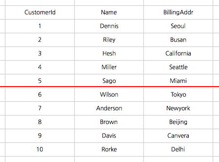
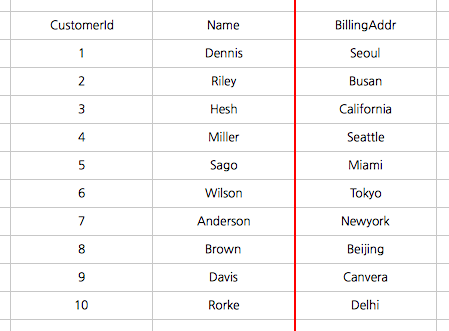
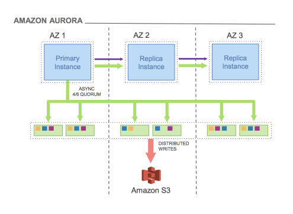

# Index

## index?

- 색인, DB가 데이터를 빠르게 찾을 수 있도록 컬럼의 값과 해당 레코드가 저장된 주소를 쌍으로 인덱스를 만들어둔다.
- Index가 있으면 FULL SCAN을 해서 조회해오던 것을 ROOT-BRANCH-LEAF-DATA BLOCK 4번의 IO를 통해 접근가능하다.

### 자료구조

- B-Tree
    - 일반적으로 사용되는 알고리즘
    - 컬럼의 값을 변형하지 않고 원래의 값을 이용해 트리구조로 인덱싱한다.
    - 디스크 I/O를 고려하여 깊이를 줄일 수 있는 B-Tree 구조 이용
    - Root Block - Branch Block - Leaf Block 으로 계층이 나뉜다.
    - key와 관련된 정보를 node에 저장한다. 리프 노드를 읽기 전 원하는 값을 찾을 수 있다.
    - 탐색 과정
        - root block을 찾는다.
        - 찾는 값이 branch block에서 가장 왼쪽 값보다 작으면 왼쪽 포인터, 사이에 있으면 중간 포인터, 더 크면 오른쪽 포인터로 찾아간다.
        - 이 과정을 통해 leaf block을 찾고 그 안에서 찾고자 하는 값이 있는지 확인한다.
    - (B+-Tree는 관련정보는 모두 리프 노드에 저장되고 key와 child pointer만 internal node에 저장된다. 임의접근, 순차접근에 우수하며 탐색시 항상 루트노드부터 탐색한다.)

- Hash
    - 컬럼의 값으로 해시 값을 계산해서 인덱스
    - 매우 빠른 검색속도
    - 값을 변형해서 인덱싱하므로 값의 일부만으로 검색 할 때는 hash를 사용할 수 없다.
    - 부등호 연산의 경우 문제가 발생한다.

### Clustered Index
- 비슷한 값들을 물리적으로 인접한 장소에 저장되어 있는 데이터
- 테이블의 프라이머리 키에만 해당되는 내용
- PK가 변경되면 레코드의 물리적인 위치도 변경이 되어야 함
- insert, delete 연산이 많은 경우 물리적으로 행을 재배열 해줘야하기 때문에 부적절하다.

### Composite Index
- title, author에 index를 주고 title로 검색하는 것은 인덱스를 탈 수 있으나, author로 검색하는 것은 index를 타지 않게 된다.
- 어떻게 쿼리할 것인지에 따라서 index를 잘 세워야 한다.

### 성능

인덱스 생성시 쓰기 작업에 별도의 과정이 추가된다.
따라서 인덱스가 많다고 해서 빨라지는 것은 아니다.
필요한 것에 전략적으로 인덱스를 생성해야 한다.

- insert 경우 인덱스에 대한 데이터를 추가해줘야 하고
- delete는 인덱스에 존재하는 값은 삭제하지 않고 사용하지 않는다는 표시를 한다.
    - row 수는 그대로이기 때문에 허수 데이터가 많이 존재할 수 있음
- update의 경우 이전 데이터가 삭제되고 그 자리에 새 데이터가 들어오는 것이기 때문에 insert와 delete의 문제점을 모두 가지고 있다.
- index 를 저장하기 위한 저장공간도 소모된다.

# Join
- 두 개 이상의 테이블을 하나의 집합으로 만드는 연산

## Nested Loop Join
- 반복문과 유사한 형태
- 반복문 외부에 있는 테이블을 선행 테이블 (Outer table), 내부에 있는 테이블을 후행 테이블 (Inner table)
- 선행테이블의 row 수 만큼 join이 수행된다.
    - 선행 테이블을 무엇으로 설정할 것인지 중요하다.
- 선행 테이블의 row가 10개이고 후행 테이블의 row가 1억개이면 후행 테이블을 10억번을 읽어야한다.
    - 후행 테이블의 초반에 조건에 일치하는 데이터를 찾았다고 하더라도 1개만 있을거라는 보장이 없어서 모두 읽어야한다.
    - 인덱스와 함께 사용이 되어야 한다.

## Sort-Merge Join
- 인덱스가 없는 경우 빨리 해당 데이터를 찾아 출력하기 위한 방법 중 하나
- 데이터들을 Sort 한 후에 Merge하여 데이터를 찾는다.
- 그러나 sort 할 때 시간이 너무 오래걸리기 때문에 RBO가 아닌 CBO에서는 Hash join을 이용한다.
    - RBO: rule based optimization, 미리 정해진 규칙에 의한 실행 계획
    - CBO: cost based optimization, 통계정보와 I/O, CPU 비용을 계산하여 실행계획을 예측

## Hash Join
- CBO 에서만 가능한 방식
- 두 개의 테이블에 인덱스가 없는 상황에서 join 하는 경우
    - 두 테이블 중 범위가 좁을 테이블을 메모리로 가져온다.
    - join 조건 칼럼의 데이터를 hash 함수에 넣어서 나온 hash value를 Hash table에 저장한다.
    - 후행 테이블의 join 조건을 has 함수에 넣어서 나온 hash value를 선행 테이블의 hash table 값과 비교하여 같은 값이 있으면 해당 칼럼의 값을 매칭

### Sort-Merge vs Hash Join
- 둘 다 모든 테이블을 읽는다.
- Sort-Merge Join은 정렬해서 작업을 수행하지만, Hash Join은 정렬을 하지 않는다.
- 테이블 특징마다 다르지만 일반적으로 Hash Join이 Sort-Merge 보다 2배 이상 성능이 좋다.
- 인덱스가 있더라도 대용량 데이터를 처리해야 하는 경우 Hash Join을 하는 경우도 종종있다.

# 정규화

## 정규화란

- 데이터베이스에서 중복을 최소화하기 위해 데이터를 구조화하는 작업
- 각 정규형에 따라 만족하지 못하는 릴레이션을 나누어서 만족도록 분해하는 작업

제 1정규형, 제 2정규형, 제 3정규형, BCNF 정규형이 있다.

## 장점

- 데이터베이스에서 이상현상을 방지할 수 있다.
    - 삽입 이상
        - 원하지 않는 자료가 삽입되거나
        - 삽입하는데 자료가 부족해서 삽입이 안되거나
    - 삭제 이상
        - 원하지 않는 자료가 삭제되거나
    - 갱신 이상
        - 정합성이 떨어지게 되거나

## 단점

- join 연산이 릴레이션간에 많아진다.
    - 역정규화를 통해 해결할 수 있다.

# 트랜잭션

## 트랜잭션이란?

작업의 완전성을 보장해주는 것

논리적인 작업 셋을 모두 완벽하게 처리하지 못한경우 원 상태로 복구하여 일부만 적용되지 않도록 한다.

DB 커넥션 개수가 제한적이기 때문에, 트랜잭션의 범위는 최소한으로 가져가야한다.

### ACID 특성

- Atomicity (원자성): 한 트랜잭션은 하나로 동작해야한다. 수행되거나, 실패하거나
- Consistent (일관성): 트랜잭션이 완료된 다음에도 일어나기 전과 동일하게 데이터 일관성을 보장
- Isolation (고립성): 각 트랜잭션은 서로 간섭없이 독립적으로 수행
- Durability (지속성): 트랜잭션이 정상적으로 종료된 후 영구적으로 DB에 결과가 저장되어야 함

# 파티셔닝

퍼포먼스, 가용성, 정비용이성을 목적으로 논리적인 데이터를 다수의 테이블로 쪼개는 행위

## 수평 파티셔닝 (= 샤딩)

- 동일한 스키마를 가진 테이블을 여러개로 복제
- 각각의 샤드에 어떤 데이터가 저장될지를 샤드키를 기준으로 분리 한다.
- 데이터 엑세스 패턴과 균등하게 저장될 수 있을지를 고려하여 샤드키를 결정해야 한다.

## 수직 파티셔닝

- 하나의 테이블에 저장된 데이터들을 여러 테이블로 분리하는 것

# replication

두 개 이상의 DBMS 시스템을 Master - Slave로 나눠서 동일한 데이터를 저장하는 방식

Master는 데이터의 수정사항을 반영만하고, Replication을 하여 Slave DBMS에 실제 데이터를 복사

Slave는 조회용으로, Master는 쓰기용으로 사용하며 부하를 분산시킨다.

비동기 방식으로 운영되어서 지연 시간이 거의 없다. 그러나 동기화가 보장되지 않아 일관성있는 데이터를 얻지 못할 수 있다.

수직적으로 구축

### 과정

- master 노드에 쓰기 트랜잭션 수행
- master 노드는 데이터를 저장하고 트랜잭션에 대한 로그를 파일에 기록 (binlog)
- slave 노드의 IO Thread는 master 노드의 로그 파일 (binlog)를 파일(replay log)에 복사
- slave 노드의 SQL Thread는 파일 (replay log)를 한 줄씩 읽으며 데이터를 저장

# 클러스터링

여러 개의 DB를 수평적인 구조로 구축하는 방식

분산함으로써 single point of failure와 같은 문제를 해결할 수 있는 fail over 시스템을 구축할 수 있다.

동기 방식으로 노드들간의 데이터를 동기화 한다. (일관성)

여러 노드들에 동기화하는 시간이 필요해서 쓰기 성능이 떨어진다.

장애가 전파된 경우 처리가 까다롭다

데이터 동기화에 의해 스케일링에 한계가 있다.

모든 노드를 활성화 시켜두는 Active-Active와 일부는 대기상태로 구성하는 Active-Standby 구조로 나눌 수 있다. 

### 과정

- 1개의 노드에 쓰기 트랜잭션이 수행되고, commit을 실행
- 실제 디스크에 내용을 쓰기 전에 다른 노드로 데이터의 복제를 요청
- 다른 노드에서 복제 요청을 수락했다는 신호를 보내고 디스크에 쓰기 시작
- 다른 노드로부터 신호를 받으면 실제 디스크에 데이터를 저장한다.

# Aurora

## Aurora

AWS에서 mysql, postresql 을 호환해서 만든 RDBMS

## RDS vs Aurora

- 스토리지
    - rds의 경우 EBS로 데이터를 쌓고 미러링하여 replica에 복제
    - 오로라는 인스턴스와 스토리지 영역이 나뉘어져 있음
        - 오로라는 4/6 쿼럼을 사용해서 스토리이지에 저장, replica로 보내는 것은 frm 및 redo log
- read replica 구성
    - rds는 standby와 read replica를 만들 때 binlog를 이용하지만
    - 오로라는 내부 storage 및 redo log 전송을 통해 동기화 한다.
- 관리 주체
    - rds의 경우 mysql, postgresql의 버전을 직접 관리하지만
    - 오로라는 aws가 개발해서 버전 업그레이드를 주기적으로 해준다.

## 참고 자료

- [https://velog.io/@soosungp33/CS-데이터-베이스](https://velog.io/@soosungp33/CS-%EB%8D%B0%EC%9D%B4%ED%84%B0-%EB%B2%A0%EC%9D%B4%EC%8A%A4)
- [https://github.com/JaeYeopHan/Interview_Question_for_Beginner/tree/master/Database](https://github.com/JaeYeopHan/Interview_Question_for_Beginner/tree/master/Database)
- [https://mangkyu.tistory.com/97](https://mangkyu.tistory.com/97)
- [https://nesoy.github.io/articles/2018-02/Database-Replication](https://nesoy.github.io/articles/2018-02/Database-Replication)
- [http://theeye.pe.kr/archives/1917](http://theeye.pe.kr/archives/1917)
