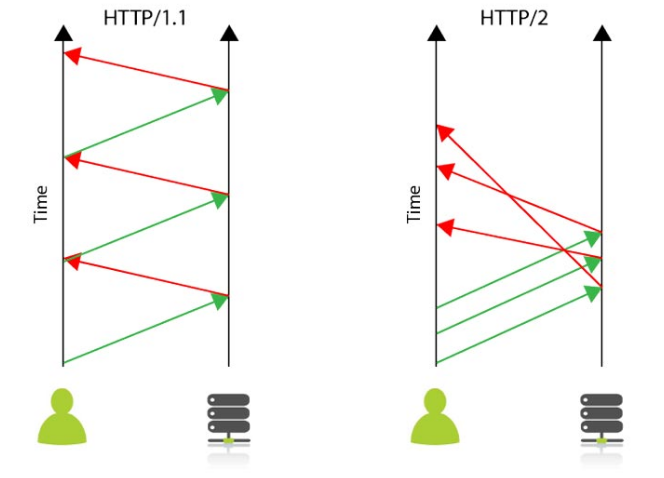

# HTTP/0.9

- 최초 HTTP 프로토콜
- 0.9 라는 버전도 추후에 구별하기 위해 붙어진 번호
- 요청은 오직 리소스의 경로와 `GET`으로 이루어져 있었음

    ```jsx
    GET /mypage.html
    ```

- 응답은 오로지 파일 내용으로만 구성
    - 오로지 HTML 파일만 전송 가능
    - 오류 코드 또한 없었음
        - 문제 발생시 HTML 파일 내부에 문제에 대한 설명과 함께 응답

# HTTP/1.0

- 프로토콜 버전 정보가 요청 시작 부분에 붙기 시작
- 상태 코드 또한 응답 시작에 붙기 시작
    - 브라우저가 요청 결과를 알 수 있고 그 결과에 따라 동작할 수 있게 됨
- HTTP 헤더가 요청과 응답에 모두 도입 됨
    - 덕분에 HTML 파일이 아닌 경우도 주고 받을 수 있게 됨 (Content-Type)
- 요청/응답 예시
    ```jsx
    GET /mypage.html HTTP/1.0
    User-Agent: NCSA_Mosaic/2.0 (Windows 3.1)

    200 OK
    Date: Tue, 15 Nov 1994 08:12:31 GMT
    Server: CERN/3.0 libwww/2.17
    Content-Type: text/html
    <HTML>
    A page with an image
      
    </HTML>
    ```

# HTTP/1.1

- 첫번째 표준
- 텍스트 프로토콜
- 커넥션이 재사용될 수 있게 함
- 파이프라이닝 추가
    - 첫번째 요청에 대한 응답이 완전히 전송되기 전 두번째 요청 전송을 가능하게 함
- 청크된 응답 지원
- 추가적인 캐시 메커니즘 도입
- 언어, 인코딩 혹은 타입을 포함한 컨텐츠 협상이 도입
    - 클라이언트와 서버로 하여금 교환하려는 가장 적합한 컨텐츠에 대한 동의를 가능케함
- `Host` 헤더를 통해 동일 IP 주소에 다른 도메인을 호스트하는 기능이 가능해짐
- 요청/응답 예시
    ```jsx
    GET /en-US/docs/Glossary/Simple_header HTTP/1.1
    Host: developer.mozilla.org
    User-Agent: Mozilla/5.0 (Macintosh; Intel Mac OS X 10.9; rv:50.0) Gecko/20100101 Firefox/50.0
    Accept: text/html,application/xhtml+xml,application/xml;q=0.9,*/*;q=0.8
    Accept-Language: en-US,en;q=0.5
    Accept-Encoding: gzip, deflate, br
    Referer: https://developer.mozilla.org/en-US/docs/Glossary/Simple_header

    200 OK
    Connection: Keep-Alive
    Content-Encoding: gzip
    Content-Type: text/html; charset=utf-8
    Date: Wed, 20 Jul 2016 10:55:30 GMT
    Etag: "547fa7e369ef56031dd3bff2ace9fc0832eb251a"
    Keep-Alive: timeout=5, max=1000
    Last-Modified: Tue, 19 Jul 2016 00:59:33 GMT
    Server: Apache
    Transfer-Encoding: chunked
    Vary: Cookie, Accept-Encoding

    (content)
    ```

# HTTP/2.0

- 구글에서 만든 비표준 개방형 네트워크프토콜인 **SPDY** 프로토콜이 기초가 됨
- 이진 프로토콜
    - 읽을 수도, 직접 만들 수도 없음
- 병렬 요청이 동일한 커넥션 상에서 다루어질 수 있는 다중화 프로토콜



- **전송된 데이터의 분명한 중복과 그로 인한 오버헤드를 제거하여 연속된 요청 사이의 유사한 내용의 헤더를 압축시킴**
- 사전에 클라이언트 캐시를 서버 푸쉬라고 불리는 메커니즘에 의해 필요하게 될 데이터로 채워넣을 수 있도록 함
- 클라이언트 요청이 없어도 서버가 리소스를 보낼 수 있음.
    - 클라이언트 요청을 줄일 수 있기 때문에 성능 향상에 도움이 됨
