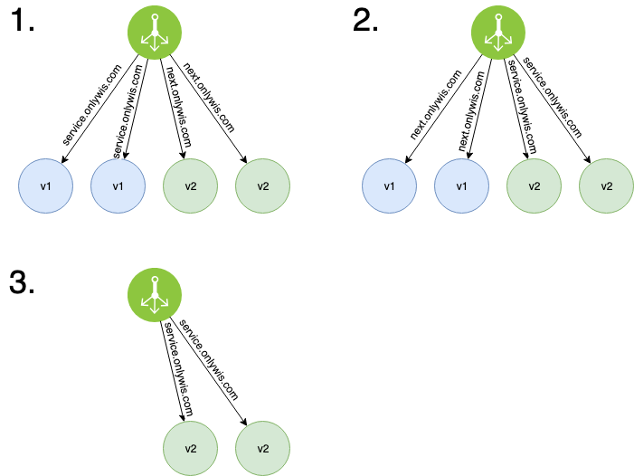
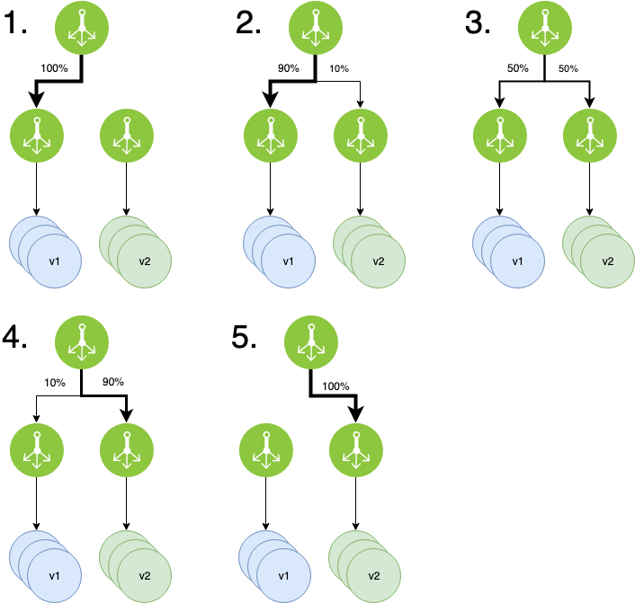

# 롤링

- 서버를 한 대씩 구 버전에서 새 버전으로 교체해가는 전략
- 롤백하려면 다시 하나씩 배포될 때까지 기다려야 한다.

# 블루 그린

- 구 버전에서 새 버전으로 일제히 전환하는 전략
- 구 버전의 서버와 새 버전의 서버들을 동시에 나란히 구성하고 배포 시점이 되면 트래픽을 일제히 전환시킨다.
- 빠른 롤백이 가능하다.
- 그러나 db connection이 2배로 되는 현상이 발생한다.

# 카나리

- 구 버전의 서버와 새 버전의 서버들을 구성하고 일부 트래픽을 새 버전으로 분산하여 오류 여부를 판단한다.
- 문제가 없다면 라우팅 되는 비율을 새버전으로 점점 늘려간다.

## 참고 자료

- [https://onlywis.tistory.com/10](https://onlywis.tistory.com/10)
- [https://reference-m1.tistory.com/211](https://reference-m1.tistory.com/211)
