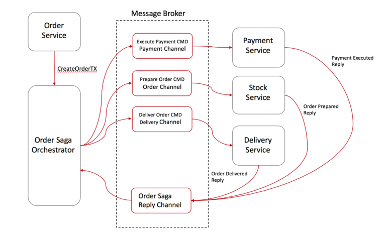

# 분산 트랜잭션

## Two-Phase Commit

- 트랜잭션 관리 주체가 DBMS에 있음
- 여러 node에 수행되어야 하는 일을 하나의 transaction으로 묶기 위해 사용
- NoSQL에서는 지원하지 않으며 함께 사용되는 DBMS가 동일해야 한다.
- 보통 하나의 엔드포인트를 통해 서비스 요청이 들어오고 내부적으로 DB가 분산되어있을 때 사용
    - MSA에서는 각 서비스의 API에서 처리하기 때문에 불가능

### 진행과정

- transaction coordinator는 transaction을 수행해야 하는 모든 node들에게 prepare 명령 전달
    - prepare: commit 요청이 오면 commit을 수행할 수 있는 상태
- transaction coordinator가 각 node들로부터 prepared ack을 받으면 다시 각 Node 들에게 commit 요청을 보낸다.
    - 만약 하나라도 prepared ack을 받디 못한다면 abort 명령을 전달한다.
- transaction coordinator는 다시 node들로부터 done ack을 받으며 트랜잭션을 종료한다.
    - done ack를 받지 못한 경우 다시 commit 요청을 보낸다.
    - 계속해서 done ack을 받지 못하는 경우 직접 트랜잭션을 종료해야 한다.

## SAGA 패턴

- 트랜잭션 관리 주체가 애플리케이션에 있음

### **Choreography-Based Saga**

- 각 애플리케이션은 로컬 트랜잭션을 마치고 트랜잭션 완료 이벤트를 다음 애플리케이션에 전달
- 일부 실패한 경우에는 롤백 이벤트를 이전 애플리케이션에 전달
- 메시지 전달시에는 kafka와 같은 메시지 큐를 이용할 수 있음
- 장점
    - 구축하기 쉬움
    - 이해하기 쉽고 간단함
- 단점
    - 여러 서비스에 트랜잭션이 걸쳐 있을 때 현재 트랜잭션 상태를 파악하기 힘듦
    - 어떤 서비스가 어떤 이벤트를 수신하는지 추측하기 힘들다.

### **Orchestraion-Based Saga**

- 트랜잭션 처리를 위한 Saga 인스턴스가 별도로 존재
- 트랜잭션에 관여된 모든 App은 Manager에 의해 점진적으로 트랜잭션을 수행하고 Manager에게 전달
- 중간에 실패시 Manager가 보상 트랜잭션을 발동하여 일관성 유지
- 장점
    - 롤백 쉽게 관리 가능
    - 서비스의 복잡성이 줄어든다.
    - 분산 트랜잭션의 중앙 집중화
- 단점
    - Orchestrator 서비스가 추가되어야 함
