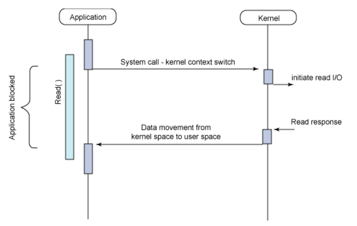
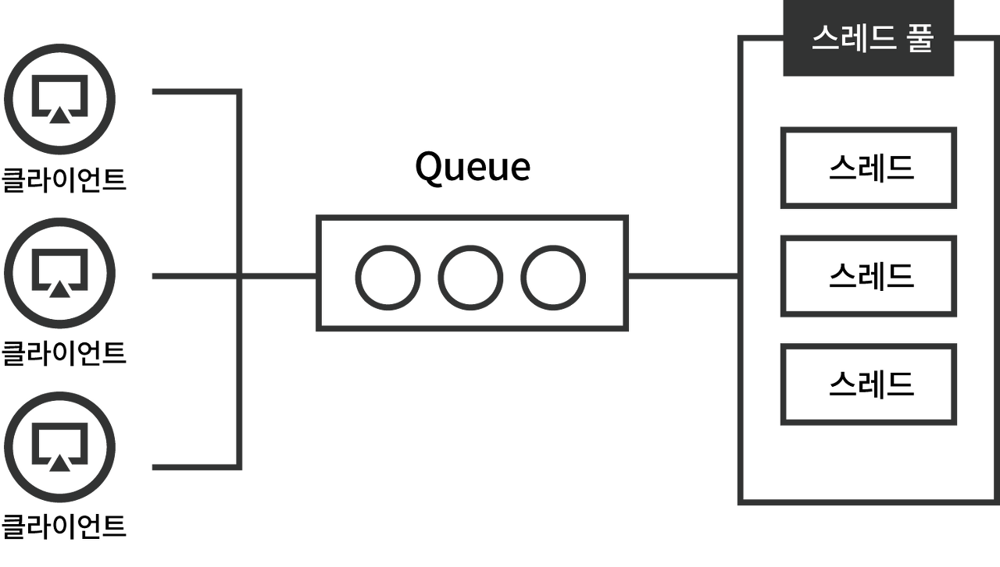
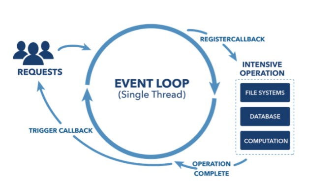
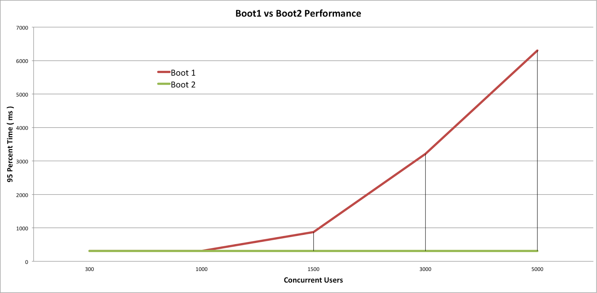

# Synchronous vs Asynchronous

## Synchronous

- 두 가지 이상의 대상이 서로 시간을 맞춰 행동하는 것
- 함수 요청 후 처리가 완료될 때까지 **기다렸다가** 응답을 받는 것

## Asynchronous

- 두 가지 이상의 대상이 서로 시간을 맞추지 않고 행동하는 것
- 요청 후 다른 일을 하다가 처리가 **완료되면** 응답을 받는 것

# Blocking vs Non-Blocking

- synchronous와 asynchronous와 관점이 다르다.
- blocking, non-blocking은 직접 제어할 수 없는 대상을 처리하는 방법에 따라 나눈다.

## Blocking I/O Model

- I/O 작업은 application 레벨에서 수행할 수 없고 Kernel Level (OS)에서 일어난다.
    - application은 커널에게 I/O 작업을 요청해야 한다. (System Call)
- Application이 Block되어 다른 작업 수행이 불가능 (자원 낭비)
- Block이 안 된 듯 보이는 이유는, Multi Thread 기반으로 동작
    - Block 되는 순간 다른 Thread가 동작함
    - Thread 간의 전환 (Context Switching)에 드는 비용이 듬

# Non-Blocking I/O Model

- 요청 후 응답까지 다른 작업을 함
- synchronous non-blocking
    - 특정시간마다 주기적으로 완료되었는지 상태를 확인 (polling)
    - 불필요한 자원 낭비 발생
- asynchronous non-blocking
    - 응답이 완료되면 이벤트를 발생시켜 알려줌
    - 미리 등록해둔 callback을 통해 이후 작업 진행

# Spring!

- 크게 reactive stack과 servelet stack으로 나뉘어짐

## Spring MVC?

- servelet stack
- 지금 세팅 되어있는 코드
- 다수의 요청이 들어오는 경우 Queue에 쌓이고 Thread Pool의 Thread들이 가져가 처리
- Thread Pool의 size보다 많은 요청이 들어오게 되면 Queue가 쌓이게 됨 (Thread Pool Hell)
- 트래픽을 측정하여 Pool size를 조정해야 함

## Spring Webflux?

- Event driven 방식
- Node.js처럼 이벤트 루프가 돌고 요청이 발생한 경우 그것에 맞는 핸들러에게 처리를 위임하고 처리가 완료되면 callback 메소드 등을 통해 응답을 반환 — non-blocking
- 사용자 요청을 대량으로 받아낼 수 있음
- 요청을 처리하는 파이프라인의 요소들이 **모두** 논블로킹하게 동작해야 유의미
    - 특정 구간에서 블로킹이 발생한다면 MVC와 동일한 문제들이 발생
    - R2DBC 를 이용하여 non-blocking 으로 DB connnection 을 만들 수 있음
- 지원하는 프로그래밍 모델
    - 어노테이션 기반 리액티브 컴포넌트
        - SpringMVC와 유사한 방식으로 구현
            - RequestMapping, PathVariable, RestController 등
    - 함수형 라우터와 핸들러
        - 라우터 함수
            - RequestPredicate을 통해 클라이언트 request를 관리하는 라우터
        - 핸들러 함수
            - 라우터 함수로 틀어온 reqeust에 대한 처리 정의

### Event-Driven

- 프로그램 실행 흐름이 이벤트에 의해 결정되는 프로그래밍 패러다임
    - ex. EventLoop는 예—전에 콘솔 만들때 방향키 입력 감지하던 무한루프 반복문
- Event가 발생할 때 이를 감지하고 적합한 이벤트 핸들러를 사용하여 처리
- 언어 레벨에서 Event Loop를 돌면서 요청을 감지하고 적합한 Handler에게 위임
    - 개발자는 단순히 Listener 액션만 등록해주면 된다.

## MVC vs WebFlux

boot1 - MVC / boot2 - WebFlux

- 사용자가 적을 때에는 유의미한 차이는 발생하지 않음
- 동기방식이 코드작성, 이해, 디버깅이 더 쉽다고 함

# Ref

- [https://www.popit.kr/spring-webflux와-kotlin으로-만드는-todo-서비스-1편/](https://www.popit.kr/spring-webflux%EC%99%80-kotlin%EC%9C%BC%EB%A1%9C-%EB%A7%8C%EB%93%9C%EB%8A%94-todo-%EC%84%9C%EB%B9%84%EC%8A%A4-1%ED%8E%B8/)
- [https://velog.io/@dyllis/Spring-MVC-vs-WebFlux](https://velog.io/@dyllis/Spring-MVC-vs-WebFlux) 👍
- [https://devahea.github.io/2019/04/21/Spring-WebFlux는-어떻게-적은-리소스로-많은-트래픽을-감당할까/](https://devahea.github.io/2019/04/21/Spring-WebFlux%EB%8A%94-%EC%96%B4%EB%96%BB%EA%B2%8C-%EC%A0%81%EC%9D%80-%EB%A6%AC%EC%86%8C%EC%8A%A4%EB%A1%9C-%EB%A7%8E%EC%9D%80-%ED%8A%B8%EB%9E%98%ED%94%BD%EC%9D%84-%EA%B0%90%EB%8B%B9%ED%95%A0%EA%B9%8C/) 👍
