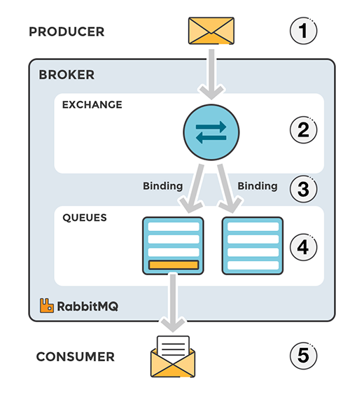
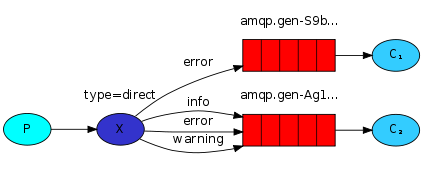
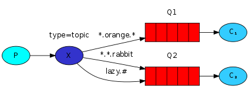

# RabbitMQ?

- AMQP를 따르는 오픈소스 메시지 브로커
- 메시지를 많은 사용자에게 전달하거나, 요청에 대한 처리시간이 길 때 해당 요청을 다른 API에게 위임하고 빠른 응답을 할 때 많이 사용
- 애플리케이션 간 결합도를 낮출 수 있는 장점도 있음

# Core Concept

## Producer

- 메시지를 생성하고 발송하는 주체
- Producer는 Queue에 직접 접근하지 않고, 항상 Exchange를 통해 접근

## Consumer

- 메시지를 수신하는 주체
- Queue에 직접 접근하여 메시지를 가져옴

## Queue

- Producer들이 발송한 메시지들이 Consumer가 소비하기 전까지 보관되는 장소
- Queue는 이름으로 구분되는데 같은 이름과 같은 설정으로 Queue를 생성하면 에러 없이 기존 Queue에 연결되지만, 같은 이름과 다른 설정으로 Queue를 생성하려고 시도하면 에러 발생

## Enxchange

- Producer들에게서 전달받은 메시지들을 어떤 Queue들에게 발송할지를 결정하는 객체
- 일종의 라우터 개념
- direct, topic, headers, fanout 4가지로 나뉘어짐

### Direct

- Routing key가 정확히 일치하는 Queue에게 메시지 전송
- 하나의 큐에 여러 개의 라우팅 키를 지정할 수 있음
- 여러 큐에 같은 라우팅 키를 지정하여 Fanout처럼 동작하게 할 수 있음

### Topic

- Routing key 패턴이 일치하는 Queue에게 메시지 전송
- 여러개의 패턴이 일치하더라도 하나의 큐에는 메시지가 하나만 전달이 된다.

### Headers

- [key: value] 로 이루어진 header값을 기준으로 일치하는 Queue에 메시지 전송
- topic과 유사하지만 header를 사용

### Fanout

- 해당 Exchange에 등록된 모든 Queue에 메시지 전송

## Binding

- exchange가 queue로 메시지를 라우팅할 규칙을 지정하는 행위
- 특정 조건의 메시지를 특정 큐에 전달하도록 설정할 수 있는데 이는 해당 exchange 타입에 맞게 설정되어야 함

# vhost

- 하나의 인스턴스 안에서 사용하고 있는 application을 분리 할 수 있음

# connection

- 물리적인 TCP connection, HTTPS → TSL Connection 사용

# channel

- 하나의 물리적인 connection 내에 생성되는 가상의 connection
- consumer가 broker로 많은 연결을 맺는 것은 바람직하지 않다.
- channel이라는 개념을 통해 하나의 TCP 연결을 공유해서 사용할 수 있는 기능을 제공한다.
- 멀티 스레드, 멀티 프로세스를 사용하는 작업에서는 각각 별도의 channel을 열고 사용하는 것이 바람직하다.

# Fair dispatch

- 하나의 Queue에 여러 Consumer가 존재하는 경우 Queue는 기본적으로 Round-Robin 방식으로 메시지를 분배
- Consumer가 2개인 상황에서 홀수번째 메시지는 처리 시간이 짧고, 짝수번째 메시지는 처리시간이 매우 긴 경우 하나의 Consumer만 일을 하게 되는 상황이 발생할 수 있음
- 이를 예방하기 위해 prefetch count를 1로 설정하면, 하나의 메시지가 처리 되어 Ack를 보내기 전에는 새로운 메시지를 보내지 않게 되어 작업을 분산 시킬 수 있다.

# 메시지 수신 통보 (Acknowledgment)

- 메시지 전달 보장을 위해 ACK라는 개념을 사용하여 메시지에 대한 응답을 보내주도록 되어있다.
- Queue는 Consumer에게 데이터를 전달하고 나면 Queue에서 메시지를 삭제하므로, Consumer가 전달받았지만 처리도중 오류가 발생하여 재처리해야 하는 경우를 위해 ACK가 온 메시지만 삭제하도록 처리한다.
- 메시지는 받았지만 ACK를 보내지 못하고 connection이 끊겨 버리는 경우 남아있는 메시지는 다음 consumer에게 메시지를 전달함
    - 여러번 처리되어도 괜찮도록 consumer를 만들어야 한다.

# RabbitMQ 재시작시

- 메시지를 Queue에 넣고 consumer에 전달되기전 죽는다면 해당 메시지는 날라가버린다.
- 이런 상황을 방지하기 위해 durable이라는 개념을 가지고 있다.

## message durability

- 메시지를 Queue에 보관할 때 file에도 같이 쓰도록 하는 방법
- Queue 생성시 durable을 true로 설정하고 메시지를 publish할 때에도 PERSISTENT_TEXT_PLAIN으로 설정해야 함

# RabbitMQ HA

- 클러스터 구성을 하면 Queue는 단일 노드에만 존재하고 복제되지 않는다.
    - exchange, bindings는 복제 됨
- 옵션을 지정해서 mirrored된 Queue를 만들 수 있으며 하나의 master와 한 개 이상의 slave로 구성할 수 있다.
- master가 사라지면 가장 오래된 slave가 master로 승격
