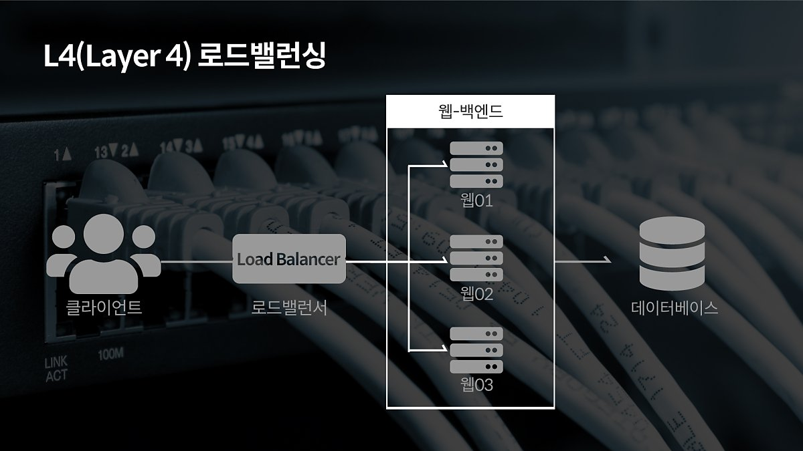
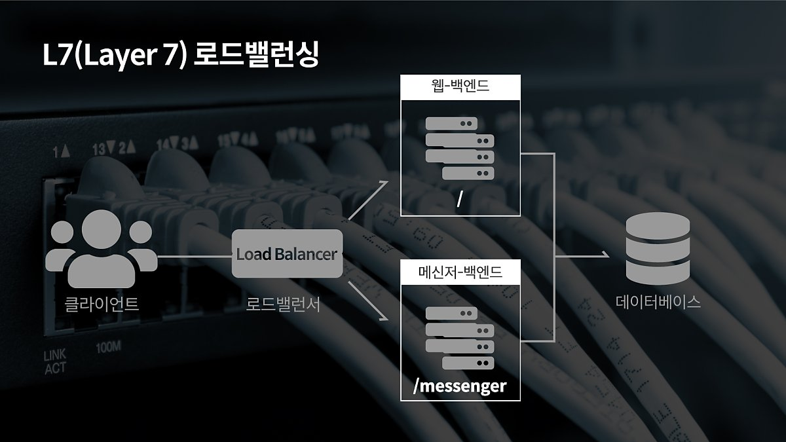

# 스케일링

## 수직적 확장 (scale up)

노드의 CPU, memory와 같은 사양을 늘리는 것

ex) RDS db.t3.micro → db.t3.small

### 장점

- 로드밸런싱이 필요없다.
- 네트워크 요청이 필요없다.
- 데이터 일관성

### 단점

- single point of failure
- 하드웨어에 제한이 있다.

## 수평적 확장 (scale out)

동일한 사이즈의 노드의 개수를 늘리는 것

ex) k8s 에서 replica 수를 늘리는 것 or HPA

### 장점

- 하나의 노드가 죽어도 괜찮다.
- 스케일링이 비교적 쉽다.

### 단점

- 로드밸런싱이 필요하다.
- 네트워크 요청이 생긴다.
- 데이터 일관성 보장 x

# 로드밸런싱

한 곳의 서버로 부하가 집중되지 않도록 트래픽을 관리하여 서버가 최적의 퍼포먼스를 보일 수 있도록 함

여러 대의 서버를 두고 서비스를 제공하는 분산 처리 시스템에서 필요한 기술

## 알고리즘

### 라운드로빈 방식

- 서버에 들어온 요청을 순서대로 돌아가며 배정
- 여러 대의 서버가 동일한 스펙을 갖고 있고, 서버와의 연결이 오래 지속되지 않은 경우 적합

### 가중 라운드로빈 방식

- 각각의 서버마다 가중치를 매기고 가중치가 높은 서버에 클라이언트 요청을 우선적 배분
- 서버별로 트래픽 처리 능력이 상이한 경우 사용되는 부하 분산 방식

### IP 해시 방식

- 클라이언트의 IP 주소를 특정 서버로 매핑하여 요청을 처리
- 사용자가 항상 동일한 서버로 연결되는 것을 보장

### 최소 연결 방식

- 요청이 들어온 시점에 가장 적은 연결 상태를 보이는 서버에 트래픽 배분
- 자주 세션이 길어지거나, 서버에 분배된 트래픽들이 일정하지 않은 경우 적합

### 최소 리스폰스타임

- 서버의 현재 연결 상태와 응답시간을 모두 고려하여 트래픽 배분
- 가장 적은 연결 상태와 가장 짧은 응답시간을 보이는 서버에 우선적으로 로드를 배분

## L4 로드밸런서와 L7로드밸런서

L4부터 포트를 바탕으로 로드를 분산하는 것이 가능해서 L4 로드밸런서와 L7 로드밸런서가 가장 많이 사용됨

한 대의 서버에 각기 다른 포트 번호를 부여하여 운영하는 경우 최소 L4 로드밸런서 이상을 사용해야 함

L4 로드밸런서는 네트워크 계층(IP)나 트랜스포트 계층 (TCP, UDP)의 정보를 바탕으로 로드를 분산

L7 로드밸런서의 경우 애플리케이션 계층 (HTTP, FTP, SMTP)에서 로드를 분산하기 때문에 헤더, 쿠키 등과 같은 사용자의 요청을 기준으로 특정 서버에 트래픽 분산을 할 수 있음 (패킷 내용을 확인)

# 캐싱

자주 접근하면서 변경이 잦지 않은 데이터의 경우 redis와 같은 곳에 캐싱 해두고 처리하면 요청을 더 빠르게 처리 할 수 있음 

# GCDN

- CSS와 js, 이미지와 같이 공통으로 호출되는 리소스를 웹 서버에서 직접 제공하지 않고 GCDN을 이용하여 트래픽을 절감할 수 있다.
- GCDN에서 지원하는 GSLB(Global Server LB) 기능은 접속한 IP 주소에서 가장 가까운 CDN 서버를 자동으로 선정해 연결해주어 빠른 서비스 속도를 체감할 수 있다.

# SSI

- Apache, nginx 등에서 지원하는 서버사이트 스크립트 언어
- 서버에 있는 파일을 읽어오거나 특정 쿠키 유무 판별 등 간단한 작업을 할 수 있다.
- 간단한 작업을 SSI에서 처리하여 WAS의 부하를 줄일 수 있다.

# MSA

[Monolithic, MSA, SOA](MicroServiceArchitecture.md) 

MSA를 이용하여 요청을 분산시킬 수 있다.

# DB Replication

[database](Database.md) 

많은 요청으로 인해 DB에 부하가 생기는 경우 database replication을 통해 부하를 분산시킬 수 있다.

## 참고

- [https://goldfishhead.tistory.com/96](https://goldfishhead.tistory.com/96)1
- [https://d2.naver.com/helloworld/6070967](https://d2.naver.com/helloworld/6070967)
- [https://m.post.naver.com/viewer/postView.nhn?volumeNo=27046347&memberNo=2521903](https://m.post.naver.com/viewer/postView.nhn?volumeNo=27046347&memberNo=2521903)
