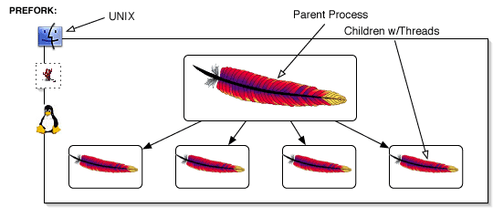
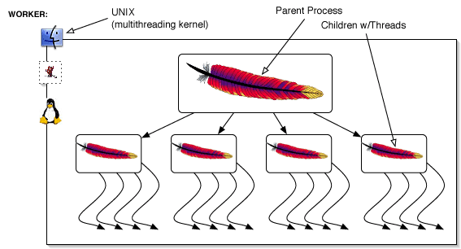

# wsgi

웹 어플리케이션 (Flask)가 웹서버 (아파치, nginx 등)과 통신할 수 있도록 하는 middleware

> [While lightweight and easy to use, Flask’s built-in server is not suitable for production as it doesn’t scale well.](https://flask.palletsprojects.com/en/1.1.x/deploying/)

플라스크 빌트인 서버가 있어서 wsgi를 사용하지 않고 배포할 수 있지만, 확장이 잘 되지 않아 production 환경에는 알맞지 않다.

Gunicorn, uWSGI, Gevent, ASGI(Async) 등을 WSGI Container로 이용할 수 있다.

# Webserver

- HTTP 프로토콜을 통해 읽힐 수 있는 문서를 처리하며 일반적으로 웹 어플리케이션의 앞단에 배치된다.
- 동적인 리소스는 WAS에게 처리하도록 하고 정적인 리소스를 보다 효율적으로 처리하기 위한 방법
- Apache와 Nginx가 있음

## Apache

- Client에서 요청을 받으면 Multi Processing Module (다중처리모듈)이라는 방식으로 처리한다.
    - Prefork MPM
        - 실행중인 프로세스를 복제하여 처리
        - 각 프로세스는 한 번에 한 연결만 처리하고 요청량이 많아질수록 프로세스는 증가하지만 개별적인 메모리 영역을 가지고 있어 안정적이다.

        

    - Worker MPM
        - 1개의 프로세스가 각각 여러 쓰레드를 사용하는 방식
        - PreFork방식보다 메모리 사용량이 적음

        

## Nginx

- 경량 웹서버
- Event Driven 방식
    - 요청이 들어오면 어떤 동작을 해야하는지 알려주고 다른 요청을 처리하는 방식
    - 고정된 프로세스만 생성하여 사용하고 비동기 방식으로 요청들을 Concurrency하게 처리할 수 있다.
    - CPU와 관계없이 모든 IO들을 전부 Event Listener로 미루기 때문에 흐름이 끊기지 않고 응답이 빠르게 진행된다.
    - 메모리 사용도 비교적 더 적다.
    - 단일 서버에서도 동시에 많은 연결을 처리할 수 있음