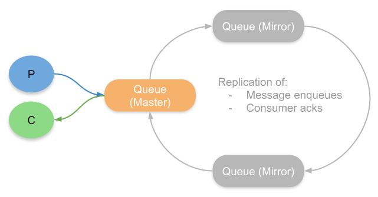
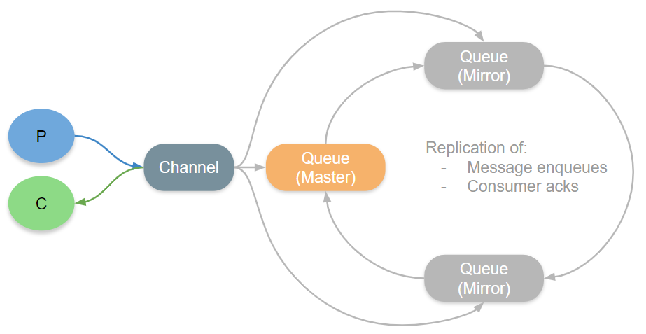
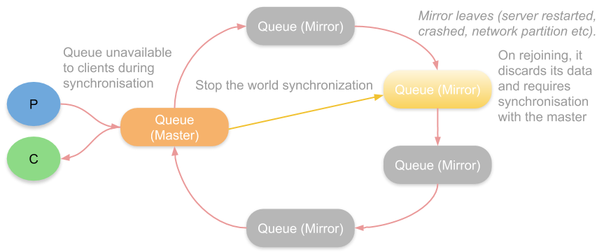
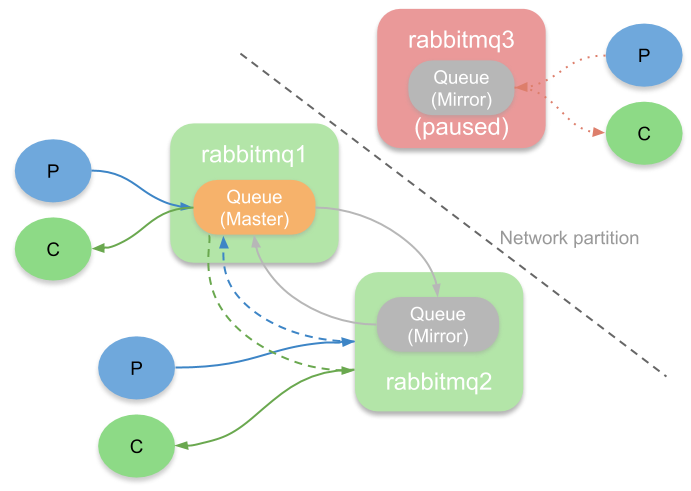
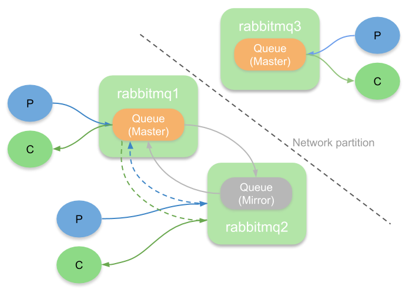
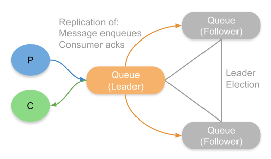

# RabbitMQ 고가용성
---

- rabbitMQ는 시스템간의 커플링 현상을 해결하는데 해결책이 되기도 하지만 특정 레벨의 QoS를 유지해야 하는 시스템에도 적합한 기능을 제공한다.
- Rabbitmq를 실행하는 노드 여러개를 하나로 묶어 클러스터라고 부른다.
- 클러스터를 생성하면, 우리는 broker를 작동하기 위해 필요한 데이터와 상태는 복제되지만, 단일 노드에 있는 큐는 복제되지 않는다. (exchange, bindings는 복제가 된다.) 이런 이유로 손실한 메시지를 가진 1번째 노드의 실행은 종료된다.

    > Creating a cluster, we certainly have the replication of data and states necessary for the operating of the broker, but this is not true for queues, that are basically located on a single node and for this reason, terminating the execution of the rabbitNode1 node we have lost the message sent.

- 이 정보를 손실하게 되는 나쁜 상황을 개선하기 위해 , RabbitMQ는 High Available Queue(Mirrored Queue)를 만들 수 있게 해준다.
    - master node에 있는 큐와 큐에서 수행되는 작업은 mirror 노드로 복제된다.
    - 하나의 노드가 죽더라도, 가용성을 유지할 수 있다.

> ***[High Availability* typically refers to some kind of automated fail-over from one instance of deployed software to another in the event of a localised failure, such as a server or disk failing, or a limited network outage. The impact of failure on availability should either not be seen or be extremely low.](https://blog.rabbitmq.com/posts/2020/07/disaster-recovery-and-high-availability-101/)**

고가용성은 일반적으로 배포된 소프트웨어가 server, 네트워크, 디스크 실패와 같은 개별적인 문제로 다른 소프트웨어로 자동으로 fail-over하는 자동화중 하나이다. 가용성에 대한 실패의 영향은 없거나 극심히 적다.

> ***[Disaster Recovery* typically refers to a response to a more major incident (a disaster) such as the loss of an entire data center, massive data corruption or any other kind of failure that could cause a total loss of service and/or data. Disaster Recovery attempts to avoid permanent partial or total failure or loss of a system and usually involves building a redundant system that is geographically separated from the main site.](https://blog.rabbitmq.com/posts/2020/07/disaster-recovery-and-high-availability-101/)**

재해복구는 일반적으로 전체 데이터 센터의 손실이나 엄청난 데이터의 손상이나 서비스 혹은 데이터 전체에 발생하는 다른 문제와 같은 더 주요한 사고에 응답하는 것을 이야기한다. 재해복구는 영구적인 일부 혹은 전체 실패 혹은 시스템의 손실을 피하기 위해 시도하고 일반적으로 물리적으로 다른 지역에 분리된 여분의 시스템을 둔다.

> [High Availability
For high availability we recommend clustering multiple RabbitMQ brokers within a single data center or cloud region and the use of replicated queues. Clustering requires highly reliable, low latency links between brokers. Clustering over a WAN is highly discouraged.](https://blog.rabbitmq.com/posts/2020/07/disaster-recovery-and-high-availability-101/)

고가용성을 위해 우리는 하나의 데이터 센터 혹은 클라우드 region 내에 여러 RabbitMQ broker를 클러스터링 하고 복제된 큐를 사용하도록 추천한다.

클러스터링은 broker 사에서 높은 신뢰도와 낮은 latency 연결을 필요로한다. WAN(광역통신망)을 통한 클러스터링은 매우 바람직하지 않다.

### 클러스터링과 AZ(가용 영역)

- 대부분의 클라우드 플랫폼은 multiple az를 제공
    - az는 매우 높은 신뢰도와 낮은 지연속도 연결이 되어있지만 지역적으로 분리되어있지 않다.
- 여러 AZ를 거쳐 클러스터링하는 것은 하나의 AZ에 클러스터링하는 것보다 고가용성을 제공할 수 있게 해준다.
- 그러나 AZ data transefer하는 비용으로 인해 돈은 좀 더 비쌀 수 있다.
- RabbitMQ에는 mirrored queues와 quorum queues 두가지의 복제 큐를 제공한다.
    - 이 큐 종류들은 동기적인 복제를 사용하고, 네트워크, 디스크 문제등으로 부터 안전하고 고가용성을 제공해준다.

### 클러스터링과 다중 데이터 센터

- 네트워크 문제에 영향을 받기 때문에 WAN을 통한 클러스터링은 장려하지 않는다.
- 공공 인터넷을 가로지르는 터널들의 링크는 간단히 살아갈 수 없다.

----

# [Mirrored and Quorum](https://blog.rabbitmq.com/posts/2020/04/rabbitmq-gets-an-ha-upgrade/)

## 왜 새로운 복제 큐 타입을 제공하는가?

- Mirrored queue는 원래 Chained Replication이라고 불리는 알고리즘을 기반에 동작하고 있었다.
- 모든 메시지는 리더인 마스터큐로 부터 publish 되고 consumed 되며, 리더는 근접한 mirror 큐에 복제하고, 이 mirror는 다시 근접한 큐에 복제를 한다.
- 이 복제는 마지막 큐가 리더에게 완전히 복제가 완료되었다고 알리기까지 반복된다.

- 그러나 몇가지 엣지 케이스로 인해서 생산된 메시지가 손실이 되는 문제가 발생하여 채널이 메시지를 처리할 때 리더뿐만아니라 각각의 Mirror 큐에도 직접적으로 보내주도록 변경되었다.
- 안타깝게도 이 방법은 브로커가 publisher로부터 각각의 메시지를 2번 받는 다는 것을 의미하고, 2배의 네트워크 부하가 발생한다.

- 그리고 mirror 큐가 장애로 인해 이 순환을 벗어나게 되는 경우에도 문제가 있다.
- 특정 mirror가 특정 타임 리밋을 넘겨 통신에 실패하게 된 경우 이 큐는 링으로부터 제거 되고 큐는 계속해서 가용가능한 상태로 남아있게 된다.
    - 해당 상황은 mirror 의 서버가 재시작하거나 크래시가 발생하거나 네트워크 문제가 발생할 때 발생한다.
- 문제는 해당 mirror가 다시 이 링에 참여하려고 할 때 발생한다.
    - 우선 mirror는 자신의 데이터를 모두 버리고 난 후, 선택적으로 동기화 하라는 명령 실행을 시작하게 된다.
    - master로부터 다시 동기화를 해올 때에는 모든 프로세스가 이 동기화가 마칠 때까지 기다리게 되는 상황이 발생한다.
    - 이것은 큐의 사용 불가 기간이 길수 있어서 큐가 클 경우 문제가 발생한다.
- 동기화를 하지 않는 방법은 동기화의 문제는 해결할 수 있지만 데이터의 중복성이 떨어진다.

- 다른 중요한 토픽은 네트워크 partition 상황을 핸들링하는 것에 대한 것이다.
- 네트워크 partion이 발생하였을 때 클러스터는 두개로 나뉘어지고 우리는 마스터와의 연결이 끊긴 mirror를 갖게 된다.
- 이 상황에서 어드민은 Availablility와 Consistency 중에 어떤 것을 선택할 것인지 설정할 수 있다. (cluster_partition_handling)
- 만약 메시지를 잃고 싶지 않다면 pause-minority 모드를 사용하면 된다.
    - 이것은 기본적으로 minority(장애가 발생한 곳)에 있는 broker를 모두 멈춘다.
    - 그리고 majority(장애가 발생하지 않은 곳)에 있는 큐는 1개조차도 없더라도 계속해서 동작한다.
    - 네트워크 문제가 해결되었을 때 클러스터는 다시 정상으로 돌아온다.
    - 이 방법은 적은 중복성이라고 할지라도 가용성을 두고 일관성을 선택하는 전략이다.

- 만약 양쪽 partition의 가용성을 계속해나가고 싶다면 우리는 ignore 혹은 auto-heal 모드를 선택할 수 있다.
- 이것은 미러가 마스터로 승격하는 것을 허용하며, 이것은 양쪽 파티션에 마스터가 생긴다는 것을 의미한다.
- 이것은 큐가 계속해서 메시지를 받고 전달하는데 문제없이 계속할 수 있다는 것이다.
- 안타깝게도 partition 상황이 해결되고 나면 하나의 partition은 해당 큐에 있던 어떠한 메시지를 잃으면서 victim(희생자)로 선택되거나 재시작되어야 한다.
- 이것은 이상적인 옵션은 아니지만 몇몇 시나리오에서는 장애상황이 되는 것보다 더 적합할 수 있다.

우리는 더 나은 복제 알고리즘이 필요했고, 그것이 quorum queue가 탄생하게 된 이유이다.

# Quorum Queues

Quorum Queues는 mirrored queues에서 사용한 chained 알고리즘을 사용하지 않는다.

대신 잘 확립되어있고 수학적으로 증명된 Raft protocol을 기반으로 한다.

Raft는 노드 클러스터에서 작업로그를 복제하기 위한 합의 알고리즘이다.

참여하는 노드들의 quorurm(majority)가 사용가능한 상태여야 하며 각각의 분산된 로그에 추가된 새로운 작업에  동의해야 한다.

이것은 quorum queues가 이름이 붙게된 이유이다.

큐는 enqueue 작업과 consumer acknowledgement 작업을 가지고 있다.

mirrored queue와 마찬가지로 모든 클라이언트는 리더와 통신하며, 리더의 job은 enqueues와 acks를 follower에게 복제하는 것이다.

이 알고리즘은 더 효율적이고 mirrored queues보다 더 높은 결과물을 달성할 수 있다.

quorum queue는 정말로 높은 end-to-end 레이턴시를 기지고 있고 이 레이턴시들은 디스크의 처리량/대기 시간에 근접하다.

quorum queues는 대부분 디스크에 기록된 경우에만 메시지를 확인하므로 디스크 성능이 쿼럼 대기열 성능에 큰 역할을 한다.

### 어렵지 않은 선택 사항

해당 큐 복제에는 기존 mirrored queue가 가지고 있던 문제점이 없으며, 모든 것에 대한 자동 vs 수동 동기화에 대해 어려운 결정을 할 필요가 없다.

quorom queues는 availabilty와 consistency 중에 선택할 필요가 없게 한다.

quorom queues는 메시지가 대부분의 노드에 복제된 후에만 메시지를 확인한다.

만약 majority가 다운되면 가용성을 잃게 되는 것이다.

### 네트워크 파티션

quorum queues에 네트워크 파티션이 발생하는 경우에 더 간단하다

빠르고 신속하게 리더를 선출하고 가용성에 영향을 주지 않으며 복원한다.

## [usecases](https://www.rabbitmq.com/quorum-queues.html#use-cases)

- 모든 문제를 해결하기 위해 만들어진 것은 아니다.
- 낮은 레이턴시와 고급 큐 기능 보다 데이터 내결함성(fault tolerance)과 안정성이 더 중요하며 큐가 더오랜 시간 지속되어야 하는 경우 사용되는 것이 좋다.
- 아래의 경우에는 사용되어서는 안 된다.
    - 큐의 임시 특성: 임시 혹은 독점적인 큐, 높은 대기열 이동 (선언 및 삭제 속도)
    - 가능한 낮은 레이턴시: 만장일치 알고리즘 기반은 본질적으로 데이터 안정성 문제로 인해 높은 레이턴시를 가지고 있다.
    - 데이터 안정성이 중요하지 않을 때 (예. 어플리케이션이 수동으로  ack 하고, publisher가 confirm하지 않는 경우)
    - 매우 긴 큐 대기열 (quorum queue는  최대 제한수까지 모든 메시지를 항상 메모리에 저장한다.)

[http://gjchoi.github.io/rabbit/rabbit-mq-HA구성/](http://gjchoi.github.io/rabbit/rabbit-mq-HA%EA%B5%AC%EC%84%B1/)