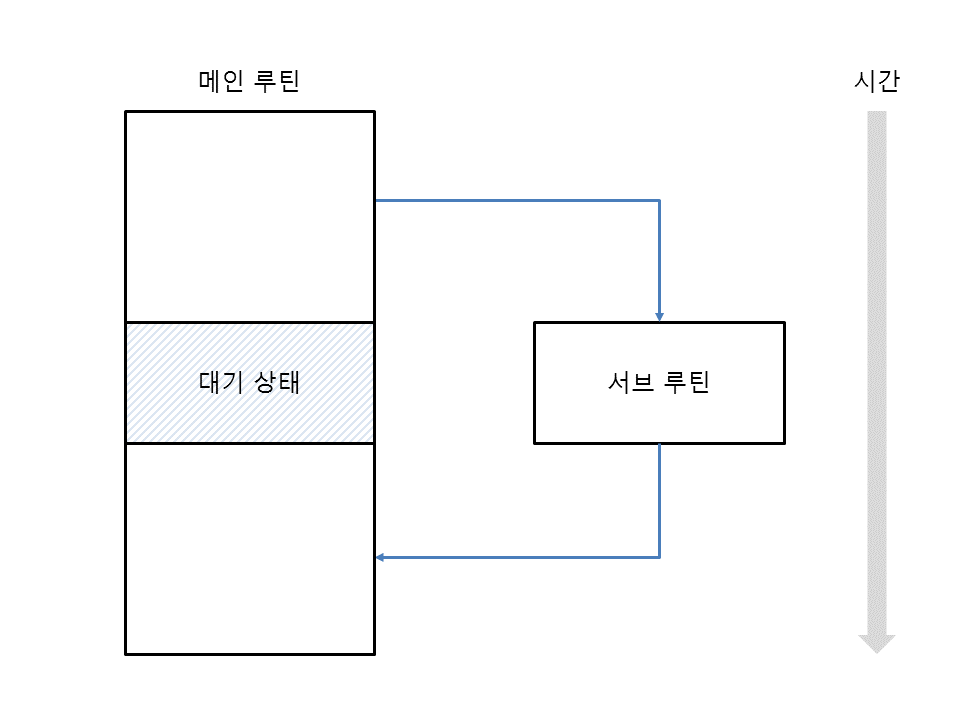
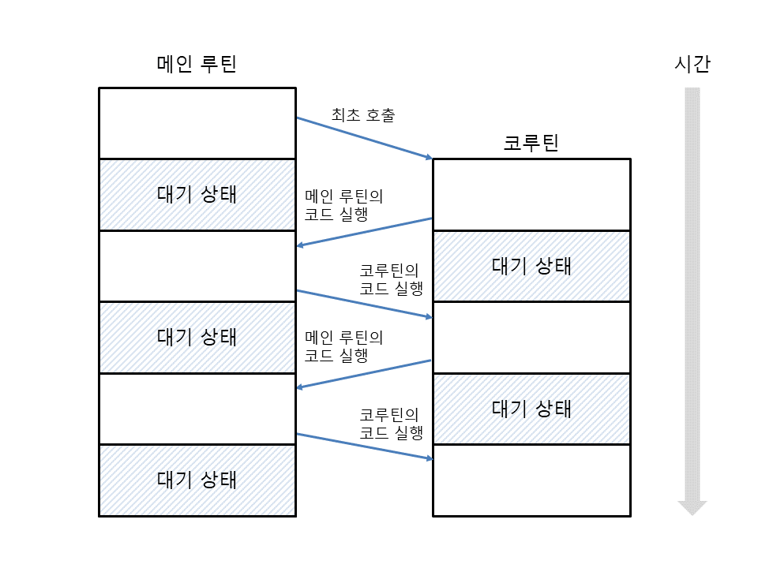

# Coroutine

## 메인 루틴과 서브 루틴

```python
def foo(a: int, b: int) -> int:
	print(f'{a} + {b} = {a + b}')
	return a + b

def bar() -> int:
	res = foo(1, 2)
	print(res)
	return res
```

`foo`는 `bar`에 의해 실행 된 이후 함수가 끝나면 다시 `bar`로 돌아오게 된다. (이때 `bar`는 메인 루틴, `foo`는 서브 루틴이다. ) 함수 종료와 함께 `foo`에서 일어났던 모든 연산과 변수는 사라지게 된다. 때문에 서브 루틴 `foo`는 메인 루틴 `bar`에 종속되어 있다고 볼 수 있다.



위 그림은 `foo`와 `bar`간의 관계를 보여주는 그림이다. 메인 루틴은 서브 루틴이 시작하고 종료 할 때까지 대기 상태를 가지게 된다. 서브 루틴은 종료와 함께 메모리에서 사라지게 된다.

## 코루틴 (cooperative routine)



`메인 루틴 - 서브 루틴`과 같이 종속된 관계가 아닌 대등한 관계를 갖는 루틴으로 필요 할 때 서로를 실행 시킬 수 있다. 보통의 함수와 다르게 **함수 실행 중간 멈추었다 메인 루틴으로 돌아가 작업 후 다시 중단된 지점부터 실행을 이어갈 수 있다.** (진입점이 여러 개인 함수이다.) 코루틴이 종료되지 않았다면 함수 내부의 변수나 연산식 등은 사라지지 않고 유지된다.

## 코루틴 예제

코루틴은 메인 루틴으로 데이터를 받아 올 수 도 있고, 메인 루틴으로 데이터를 전달 할 수 도 있다.

### 메인 루틴에서 코루틴으로 데이터 전달하기

다음은 메인 루틴에서 0부터 2까지 숫자를 코루틴으로 차례로 전달하고 코루틴에서 데이터를 출력한다.

- coroutine_test_01.py
    ```python
    def coroutine():
      while True:
        x = yield
        print(x)


    co = coroutine()
    next(co) # 첫 yield까지 실행하게 만든다.

    for i in range(3):
      co.send(i) # send를 통하여 코루틴으로 데이터를 전달한다.

    co.close() # 코루틴을 종료한다.
    ```
- output
    ```
    0
    1
    2
    ```

### 코루틴에서 메인루틴으로 데이터 전달하기

다음은 메인 루틴으로부터 전달받은 0부터 2까지의 데이터를 누적 연산 후 다시 메인 루틴으로 데이터를 전달하는 예제이다.

- coroutine_test_02.py

    ```python
    def coroutine():
    	total = 0
    	while True:
    		x = yield total
    		total += x

    co = coroutine()
    next(co) # 첫 yield까지 실행하게 만든다.

    for i in range(3):
    	print(co.send(i))

    co.close() # 코루틴을 종료한다.
    ```

- output
    ```
    0
    1
    2
    ```

**메인 루틴에서 코루틴으로 데이터 전달을 하지 않고 `next`만을 이용하는 경우 일반 [제너레이터](https://www.notion.so/yool/generate-cde8c5e5d21b4045a58e414f99fb597f)와 같다.**

### 코루틴 종료되는 시점에 특정 작업 수행하기

- coroutine_test_03.py
    ```python
    def coroutine():
      try:
        total = 0
        while True:
          x = yield total
          total += x
      except GeneratorExit:
        print('코루틴 종료')

    co = coroutine()
    print(next(co)) # 해당 라인이 없을 경우 `GeneratorExit`가 발생하지 않는다.

    co.close() # 코루틴을 종료한다.
    ```
- output
    ```
    0
    코루틴 종료
    ```

## Coroutine vs Thread
- 스레드의 경우 여러 개의 작업을 병렬로 수행하여 비동기적으로 작업
- 코루틴은 실제로 병렬로 수행되지 않고 여러 개의 작업을 잘게 쪼개 작업을 수행
