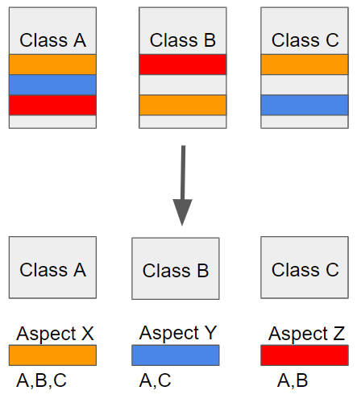

# AOP

- Aspect-Oriented Programming
- 관점 지향 프로그래밍
    - 어떤 로직을 기준으로 핵심적인 관점, 부가적인 관점으로 나누어서 보고 그 관점을 기준으로 각각 모듈화하는 프로그래밍 방식

- 흩어진 관심사를 Aspect로 모듈화하고 핵심적인 비즈니스 로직에서 분리하여 재사용하겠다는 취지
    - 예로 로깅이나, 권한 체크, 트랜잭션 관리와 같은 로직은 전체적인 비즈니스 로직에 흩어지게 된다.
    - 이러한 로직을 비즈니스 로직에 구현하는 것이 아닌 별도 모듈로 분리하고, 어떤 비즈니스로직에 적용할 것인지 명시하는 방법

## Spring AOP

## 개념

- Aspect : 위에서 설명한 흩어진 관심사를 모듈화 한 것. 주로 부가기능을 모듈화함.
- Target : Aspect를 적용할 대상
- Advice : 실질적으로 어떤 일을 해야할 지에 대한 것, 실질적인 부가기능을 담은 구현체
- JointPoint : Advice가 적용될 위치, 끼어들 수 있는 지점. 메서드 진입 지점, 생성자 호출 시점, 필드에서 값을 꺼내올 때 등 다양한 시점에 적용가능
- PointCut : JointPoint의 상세한 스펙을 정의한 것. 'A란 메서드의 진입 시점에 호출할 것'과 같이 더욱 구체적으로 Advice가 실행될 지점을 정할 수 있음

### Target의 종류

- 특정 경로에 있는 특정 객체의 모든 메서드에 적용할 수 있음
- 특정 어노테이션이 붙은 포인트에 적용할 수 있음
- 스프링 빈의 모든 메서드에 적용할 수 있음
- 특정 인자를 가진 메서드
- 이외에도 더 많은 기능을 제공

### AOP 실행 시점

- Before: 타겟 메서드 호출 전 실행
- After: 타겟 메서드 결과와 관계없이 수행
- AfterReturning: 타겟 메서드가 성공적으로 결과값을 반환하는 경우 실행
- AfterThrowing: 타겟 메서드가 수행 도중 예외를 던지는 경우 실행
- Around: 타겟 메서드 실행 전 후