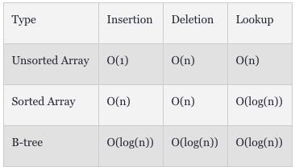

# (번역) How Database B-Tree Indexing Works

아래 글은 [해당](https://dzone.com/articles/database-btree-indexing-in-sqlite) 문서를 번역한 글입니다.
---

우리가 데이터베이스의 성능에 대해 생각 할 때, 인덱스는 가장 먼저 생각나는 부분이다. 이 글을 통해서 우리는 어떻게 인덱스가 데이터베이스에서 동작하는지 알아볼 예정이다. 

# B-Tree가 무엇인가?

B-Tree는 데이터를 정렬된 순서로 노드에 넣고 저장하는 데이터 구조이다. 우리는 아래와 같이 B-Tree 예시를 표현할 수 있다.


B-tree는 오름차순 순서로 키를 포함한 각 노드들을 저장한다. 각각의 키들은 다른 2개의 자식 노드들을 향한 참조를 하고 있다. 왼쪽에 있는 자식 노드 키는 현재 키보다 작고, 오른쪽에 있는 자식 노드의 키는 현재 키보다 크다. 만약 1개의 node가 n개의 키를 가지고 있다면 그것은 최대 n+1개의 자식 노드를 가질 수 있다. 

# 데이터베이스에서 인덱싱을 사용하는 이유

당신이 무수한 숫자의 리스트를 파일에 저장하고 그 리스트의 수를 탐색할 수 있어야 한다고 상상해봐라. 가장 단순한 방법은 데이터를 배열에 저장하고 새로운 값이 추가도리 때마다 값을 append하는 것이다. 그러나 만약 당신이 주어진 값이 배열에 존재하는지 체크해야 한다면, 당신은 모든 배열의 요소를 하나하나 확인하고 주어진 값이 존재하는지 아닌지 확인해야 한다. 만약 운이 좋다면 당신은 주어진 값을 가장 첫 요소에서 찾을 수 있겠지만, 최악의 경우에는 그 값은 배열의 마지막 요소에서 발견될 수도 있다. 우리는 이 최악의 경우를 점근표기법으로 O(n)이라고 나타낸다. 즉 당신의 배열 크기가 n개인 경우 당신은 주어진 값을 배열에서 찾기 위해 최대 n 번의 검색을 해야 한다.

어떻게 이 시간을 개선할 수 있을까? 가장 쉬운 방법은 배열을 정렬하고 값을 찾기 위해 binary search를 하는 것이다. 당신이 배열에 값을 넣으려고 할 때마다 이 순서는 항상 관리되어야 한다. 검색은 배열의 중간 값을 선택하는 것에 의해 시작된다. 그리고 선택된 값을 검색하고자 하는 값과 비교한다. 만약 선택된 값이 검색된 값보다 큰 경우 배열의 왼쪽 값은 무시하고 오른쪽의 값을 검색하거나 반대로 검색합니다.


우리가 3, 6, 8, 11, 15, 18로 이루어진 이미 정렬이 완료된 배열에서 15를 찾으려고한다. 만약 일반 검색을하게 되면 요소가 5번째에 위치하기 때문에 5번의 절차가 필요해진다. 그러나 binary search를 하면 오직 3번이면 검색할 수 있다.

만약 우리가 binary search를 배열의 모든 요소에 적용한다면 아래와 같이 될 것이다. 


뭔가 비슷해보이지 않는가? 이것은 Binary Tree 이다. 이것은 B-Tree의 가장 단순한 형태이다. Binary Tree 덕분에 우리는 정렬된 배열을 저장하는 것 대신에 포인터를 사용할 수 있게 되었다. 수학적으로 우리는 binary tree에서 검색하는데 걸리는 최악의 시간을 O(lon(n))으로 증명할 수 있다. 이 Binary tree의 개념은 B-tree라고 알려진 일반화된 형태로 확장시킬 수 있다. B-트리는 단일 노드에 대해 항목 배열을 사용하며 이러한 각 항목에 대해 하위 노드를 참조한다.



B+Tree는 데이터를 저장하는데 사용되는 B-tree와 거의 흡사해보이는 다른 자료구조이다. B+tree의 오직 한가지 다른 점은 자료를 leaf node에 저장한다는 것이다. 이 뜻은 lefa node가 아닌 node들의 값이 leaf node에 중복되어있다는 것이다. 아래는 B+tree의 예시이다.


13, 30, 9, 11, 16, 38 이라는 leaf 노드가 아닌 값들이 leaf node에 다시 반복되고 있다. 이 tree의 leaft node에서 특별한 점을 확인할 수 있는가?

그렇다. leaf node는 모든 값이 포함되고 모든 레코드가 정렬된다. B+tree 만의 특이점으로는 당신은 B-tree와 동일하게 검색할 수 있다는 것이며, 게다가 우리가 각 leaf node들에 아래와 같이 pointer를 추가한다면 당신은 leaf node의 모든 값을 통해 탐색할 수 있다.


# 데이터베이스에서 인덱스가 사용되는 방법

B-tree가 데이터베이스 인덱싱이 되었을 때, 이 자료구조는 key 뿐만 아니라 key와 관련된 값들도 가지고 있어야 하기 때문에 살짝 복잡해진다. 이 값은 실제 데이터 record를 참조하고 있다. 키와 값은 함께 페이로드라고 불린다.

아래 3개 컬럼을 가진 테이블이 데이터 베이스에 저장되기 위해 필요하다고 가정해보자.


우선, 데이터베이스는 unique random index (혹은 primary key)를 각각의 주어진 recod에 만들고 관련된 row를 byte stream으로 변환한다. 그리고 이것을 키와 record byte stream 각각을 B+tree에 저장한다. 여기에서는 random index가 인덱싱을 위한 키로 사용되었다. 키와 record byte stream은 함께 payload라고 불린다. B+tree의 값은 아래와 같이 표현될 수 있다.


당신은 모든 레코드가 B+tree의 leaf node에 저장되었고, index는 B+tree를 만들기 위해 key로 사용된 것을 확인할 수 있다. leaf node가 아닌 곳에 저장된 레코드는 없다. 각각의 leafh node들은 tree의 다음 레코드를 참조하고 있다. 데이터베이스는 이 index를 이용하여 binary search를 수행하거나, leaf node들만 탐색함으로써 모든 요소들을 통해 순차 검색을 수행 할 수 있다.

만약 indexing이 사용되지 않는다면, 데이터베이스는 이 레코드들의 각각을 주어진 레코드를 찾기 위해 읽어야한다. indexing이 가능해진다면 데이터베이스는 아래와 같이 테이블의 컬럼들 각각을 위해 3개의 B-tree를 만들 수 있다. 여기서 키는 인덱싱에 사용되는 B-tree 키입니다. index는 실제 데이터 레코드를 참조합니다.


먼저 index를 사용할 때, 데이터베이스는 B-tree에 대응하여 지정된 키를 검색하고 O(log(n)) 시간 내에 인덱스를 가져옵니다. 그리고 난 후, 찾은 인덱스를 O(log(n)) 시간으로 B+트리에서 검색을 수행하고 레코드를 가져옵니다.

B-tree와 B+tree에 있는 각각의 노드들은 Pages 안에 저장됩니다. Pages는 고정된 사이즈를 가지고 있습니다. Pages는 1부터 고유한 숫자를 가지고 있습니다. 페이지의 시작에는 rightmost child page number, first free cell offset, first cell offset과 같은 페이지의 메타적인 정보가 담겨져있습니다. 데이터베이스에는 2가지 종류의 페이지가 있을 수 있습니다:

1. 인덱스를 위한 페이지: 이 페이지들은 오직 index와 다른 페이지에 대한 참조만 저장합니다.
2. record를 저장하기 위한 페이지: 이 페이지는 실제 데이터를 저장하고, 페이지는 leaf page여야 한다.

# SQLite B-tree index 사용

B-tree index를 만드는 기본적인 문법은 아래와 같다.

```sql
CREATE INDEX index_name ON table_name;
```

SQLite에는 3가지 종류의 indexing method가 있다.

1. 단일 컬럼 인덱스

인덱스들은 테이블 컬럼에 기반하여 만들어진다. 오직 하나의 B-tree가 인덱스를 위해 만들어진다.

문법은 아래와 같다.

```sql
CREATE INDEX index_name ON table_name (column_name);
```

2. 고유 인덱스

고유 인덱스는 중복된 값이 인덱스를 이용하는 컬럼에 저장되는 것을 허용하지 않는다. 문법은 아래와 같다.

```sql
CREATE UNIQUE INDEX index_name on table_name (column_name);
```

3. 복합 인덱스

이 인덱스 종류는 여러개의 인덱스들을 가질 수 있다. 인덱스 컬럼 각각을 위하여 B-tree가 존재한다. 문법은 아래와 같다.

```sql
CREATE INDEX index_name on table_name (column1, column2);
```

# 결론

데이터베이스는 데이터의 저장, 조회, 수정을 효율적으로 할 수 있는 방법을 가지고 있다. B-tree는 데이터를 추가하고 읽는데 효율적인 방법을 제공한다. 실제 데이터베이스 구현에서는 데이터를 저장하기 위해 B-tree와 B+tree를 함께 사용한다. B+tree는 순차 검색과 binary search를 모두 제공하여 데이터베이스에서 색인되지 않은 값을 검색하기 위한 더 많은 제어 기능을 제공한다.
