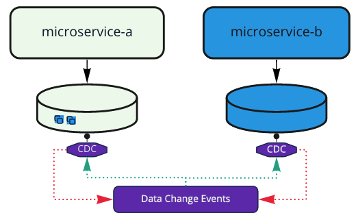

# (번역) Microservices Databases

아래 글은 [해당](https://medium.com/swlh/microservices-databases-b4cb949d0544) 문서를 번역한 글입니다.
---

# Microservices and SOA

마이크로 서비스는 아키텍쳐 패턴 트렌드이다. 만약 개발자이거나 IT 계열 종사자라면 마이크로서비스에 대해서 들어보았거나 읽어본 적이 있을 것이다. 마이크로서비스 원칙은 그들의 주요 도메인을 기반으로 작은 컴포넌트들을 만드는 것이다. 많은 글쓴이들이 마이크로서비스가 고전 SOA의 진화된 것이라고 생각한다. SOA와 마이크로서비스 모두 더 큰 시스템을 작고, 응집력 강하고, 재사용이 가능하며, 관리되는 컴포넌트들로 쪼개는 것이다.

SOA는 2000년대 매우 유행했던 아키텍처 패턴이다. 많은 회사들이 여전히 SOA를 채택하고 있다. 절충에도 불구하고 마이크로서비스는 새로운 프로젝트를 위해 선호되는 아키텍처가 되었다.


# Bounded Context

마이크로 서비스를 적용할 때 우리는 바운디드 컨텍스트에 기반하는 마이크로서비스들을 정의한다. 바운디드 컨텍스트는 비즈니스 로직의 경계들이다. 하나의 도메인 혹은 서브도메인에 연계된 서비스 기능들은 모두 동일한 컨텍스트에 있다. 우리는 국경선과 바운디드 컨텍스트를 비교할 수 있다. 각 나라들은 그들만의 문화, 언어, 규율 등을 가지고 있다. 이것과 마찬가지로 각각의 마이크로 서비스는 그들만의 데이터베이스, 프로그래밍 언어, 그리고 하나의 연관된 도메인을 가지고 있다.

SOA에서는 수직적인 방법으로 컨텍스트를 조직한다. 다수의 컴포넌트들은 다수의 기능을 제공하는 동일한 서비스의 일부분이 될 수 있다.  SOA 서비스는 바운디드 컨텍스트와 같다. SOA는 동일한 도메인 내에서의 재사용과 조합을 촉진시킨다. 각각의 SOA 서비스는 더 작은 컴포넌트들의 그룹을 표현한다. 마이크로서비스와 마찬가지로 각각의 컴포넌트들은 다른 기술 스택을 이용하여 개발될 수 있다. SOA에서는 대부분 모든 서비스들을 동일한 기술 스택과 동일한 DB 기술을 이용한다.

# Shared Database

말했다시피 SOA에서는 일반적으로 서비스들이 동일한 데이터베이스 기술을 사용한다. 따라서 도메인 경계를 넘고 다른 컨텍스트에서 데이터베이스에 엑세스 할 수 있는 하위수준의 서비스가 선호된다. SOA에서는 서비스가 다른 서비스의 데이터베이스로 접근하지 말아야한다는 원칙이 없다. 그래서 찬반과 관계없이 이 관행은 받아들여질 수 있다.

마이크로서비스에서는 강한 경계를 지켜야한다. 각 서비스들은 그들만의 독자적인 데이터베이스와 관계된 하나의 컨텍스트를 가지고 있다. 이름과는 다르게 마이크로 서비스는 컴포넌트와 관련하여 실제로 SOA보다 덜 세분화되어있다.


# Crossing the domain borders

가치를 주기 위해 서비스들은 다른 컨텍스트에 있는 데이터 또한 필요하다. 보시다시피 SOA는 이 문제를 그들의 데이터 접근을 공유함으로써 해결하고 있다. 저수준의 서비스들은 여러 DB와 연결하고 데이터를 제공한다. 다양한 컴포넌트들은 특정 도메인과 관련된 데이터베이스를 호출할 수 있다.

마이크로서비스는 "한 서비스당 하나의 데이터베이스" 접근법을 따른다. (여기서 하나의 데이터베이스란 하나의 테이블을 뜻하지 않는다.) 또한 데이터베이스 기술을 고르는 것은 개발팀에 의해 결정된다. 하나의 서비스가 MySQL을 사용하는 동안 다른 서비스는 PostgreSQL 심지어는 MongoDB와 같은 NoSQL 데이터베이스를 이용할 수 있다. 이런 데이터베이스에 구애받지 않는 환경에서는 도메인간 참조 무결성이 없다.

만약 하나의 데이터베이스 기술을 사용한다면, 모든 컨텍스트 사이에서의 참조 무결성을 셀 수 있다. 참조무결성은 개발자를 보호하지만 코드가 지속성에 맞게 조정된다. 동일한 데이터베이스를 사용하는 컴포넌트들은 데이터베이스 제약 조건을 따라야 한다.

마이크로서비스는 다른 방향으로 이동했다. 자율적인 팀을 활성화하기 위해서 마이크로서비스는 동작하는데 필요한 모든 것을 포함해야 하지만, 바깥에서는 그것을 확인할 수 없도록 숨겨져있다.

각 마이크로서비스는 작은 나라와 같다. 이런 독립은 기민함과 혁신을 촉진 시키지만, 구성요소가 데이터베이스를 공유하는 대신에 외부 컨텍스트에서 데이터의 복제본을 만들어야 할 필요가 있다는 것을 뜻한다.


# Event-Driven Architectures

데이터베이스가 아닌, 데이터를 공유하는 것은 반드시 어떻게든 이루어져야 한다. 문제는 데이터가 변경된 것을 소유자만 알고 있다는 것이다. 원본을 필요로하는 모든 서비스의 리스트를 관리는 것은 어렵고, 쉽게 outdated될 수 있다. 또한 마이크로서비스간 곧바로 요청하는 것은 강한 의존이 생길 수 있다. 이러한 이유들로 마이크로 서비스는 이벤트 주도 아키텍쳐와 잘 어울린다.

이벤트 주도 아키텍쳐에서는 마이크로서비스가 이벤트를 publish 하고(producer), 토픽을 subscribe한다(consumer). 마이크로서비스들은 생성된 이벤트들을 누가 사용하는지, 사용하는 이벤트를 누가 생성하는지 신경쓰지 않는다.


이벤트 기반은 컨텍스트간의 데이터를 공유하는 문제를 해결해준다. 그러나 이벤트 형식은 표준화 되지 않았다. **생산자는 소비자가 이벤트를 소비하기 전에 반드시 이벤트 스키마를 공유해주어야 한다. 그 후, 소비자는 이벤트를 원본 스키마로부터 그들 데이터 도메인에 맞도록 변환해주어야한다.**

공통 이벤트 사양을 위한 많은 노력은 계속해서 진행 중이다. Cloudevents 명세를 언급하는 것이 가치가 있을 것 같다. Cloudevent는 혼돈 속에서 어느정도 질서를 추가하기 위해 시도 중이다. Cloudevent는 다른 생산자들이 동일한 언어로 이야기할 수 있도록 만들기 위해 시도하고 있다.

서로 다른 도메인에 걸친 Entity 관계는 존재한다. 반면에 우리는 외부 컨텍스트로부터 데이터를 복제해오지 않아도 된다. 참조 무결성은 과거의 많은 실수들을 피하고, 개발자들이 조금 더 쉽게 살 수 있도록 만들어준다. "데이터 베이스를 공유하지 않는다."는 원칙은 데이터 통합 전략에 어려움을 준다.

# Change Data Capture

Change Data Capture (CDC)는 데이터 통합에 집중한 디자인 패턴이다. CDC 디자인 패턴은 꽤 단순하다. 이것은 원본 데이터에 대한 모든 데이터 변경을 가져와 이벤트로 publish 하는 것이다.


데이터 변경 이벤트는 데이터 변경과 관련된 세부사항을 포함하고 있다. 이 이벤트는 데이터의 새 버전과 이전 버전 및 컨텍스트에 대해 설명한다. CDC를 사용하면 Entity 관계 모델 (MER) 다이어그램을 스키마 정의로 제공할 수 있다. 이것은 데이터 변경을 위한 표준 스키마에 대한 이벤트 기반 아키텍쳐의 격차를 채워준다.

아래는 CDC event의 예시이다.

```json
{
  "schema": {...},
  "payload": {
    "before": {  
      "id": 1004,
      "first_name": "Anne Marie",
      "last_name": "Kretchmar",
      "email": "annek@noanswer.org"
    },
    "after": null,  
    "source": {  
      "name": "1.4.1.Final",
      "name": "dbserver1",
      "server_id": 223344,
      "ts_sec": 1486501558,
      "gtid": null,
      "file": "mysql-bin.000003",
      "pos": 725,
      "row": 0,
      "snapshot": null,
      "thread": 3,
      "db": "inventory",
      "table": "customers"
    },
    "op": "d",  
    "ts_ms": 1486501558315  
  }
}
```

또한 이것을 사용하면, 데이터 이벤트에 대해 신경 쓸 필요가 있는 것은 서비스가 아닌 데이터베이스이다. CDC 도구는 동시에 여러 데이터 원본에 연결할 수 있다. CDC는 데이터 원본에 연결 될 수 있으며 코드가 아닌 설정을 통해 인바운드 및 아웃바운드 이벤트를 활성화 할 수 있다. 



가장 인기있는 CDC 툴은 [Debezium](https://debezium.io/)이다. 이 이름은 Database의 "DB"와 주기율표에서 자주 사용하는 "-ium"의 조합으로부터 만들어졌다. Debezium 플랫폼은 데이터 변경 이벤트 로그로써 Kafka를 사용한다. 1.2.x 버전부터 Debezium은 이벤트 기반 아키텍쳐의 매끄러운 통합의 가능성을 열어주는 CloudEvent 형식 지원을 포함하고 있다.

Debezium과 같은 많은 CDC툴에 사용되는 플러그형 모델은 데이터베이스 복제, 피드 분석 시스템, KPI 생성 및 캐시 붙이기에 매우 유용합니다. 예를 들어 모놀리틱 시스템이 마이크로서비스로 마이그레이션하는 동안에 새로운 독립적인 데이터베이스에 데이터를 공급할 수 있는 CDC Event를 생산하기 시작할 수 있습니다. 혹은 RDB로부터의 이벤트를 NoSQL Database로 매끄럽게 공급할 수 있습니다.

# In summary

마이크로 서비스는 하나의 서비스당 하나의 데이터베이스를 갖는 접근법을 따르고 있다. 이것은 외부 의존없이 혁신과 진화를 만들게 할 수 있다. 이벤트 주도 아키텍쳐는 다른 마이크로 서비스간의 통신을 수월하게 해주지만 이벤트 스키마를 공유하는 규격화된 방법이 부족하다. 컨텍스트 경계에 걸쳐 도메인 모델을 공유하는데에는 몇 가지 이점이 있다. CDC는 조립가능하지만 분리된 방법으로 다른 데이터 원본들로 부터 데이터를 통합한다. CDC는 모놀리식에서 마이크로 서비스로 마이그레이션 하거나 이벤트 기반 아키텍쳐로 전환하는데 있어서 매우 유용하다.