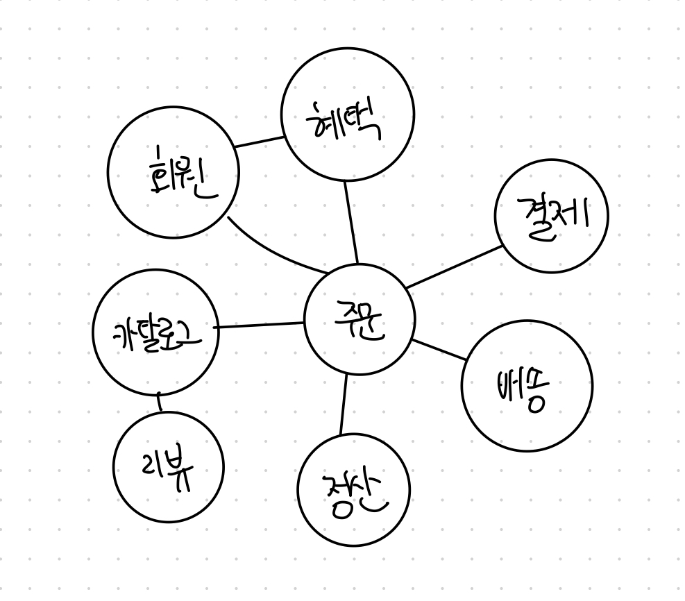
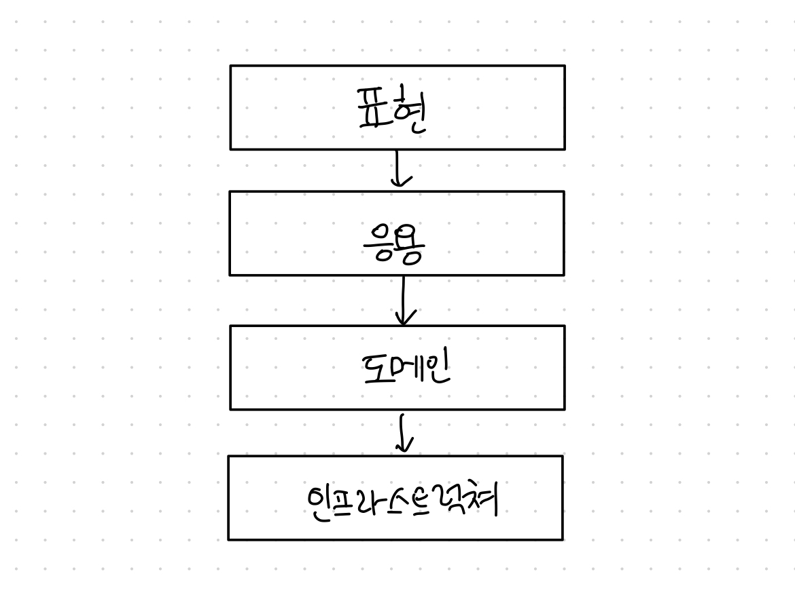
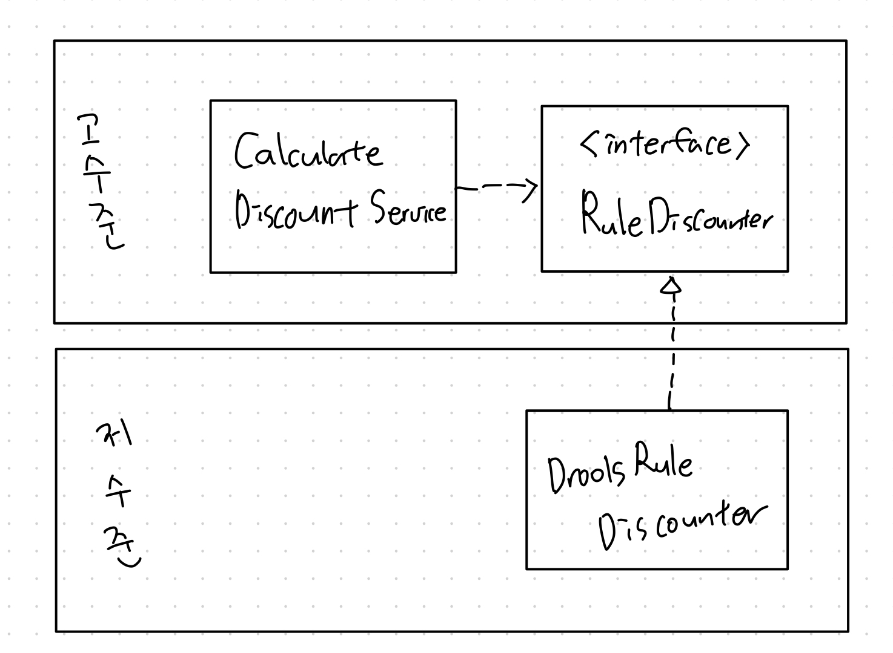
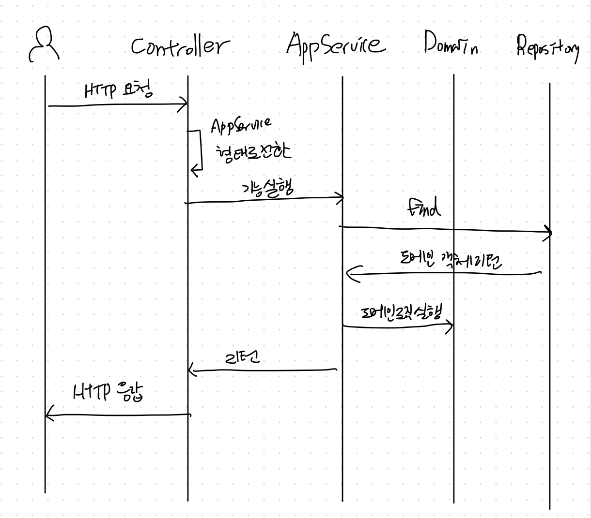

# 도메인 모델 시작

## 도메인 (domain)

- 소프트웨어로 해결하고자 하는 문제 영역
    - ex. 온라인 서점
- 하나의 도메인은 다시 하위 도메인으로 나눌 수 있다.
    - ex. “온라인 서점”의 경우 아래와 같이 나눌 수 있다.

    

- 소프트웨어가 도메인의 모든 기능을 제공하지는 않는다. 배송, 결제와 같은 도메인의 경우에는 대행 업체를 이용해서 처리할 수 있다.
- 하위 도메인의 구성은 상황에 따라 달라진다.

## 도메인 모델

- 특정 도메인을 개념적으로 표현한 것, 도메인 자체를 이해하기 위한 개념 모델
- 도메인 모델을 이용하면 여러 관계자들이 동일한 모습으로 도메인을 이해하고 도메인 지식을 공유하는데 도움이 된다.
- 도메인 모델은 객체, 그래프, 상태다이어그램 등 다양한 형태로 표현될 수 있다.
    - 도메인을 이해하는데 도움이 되는 적합한 방법으로 표현하면 된다.
- 개념 모델은 트랜잭션 처리, 성능 등을 고려하지 않고 있기 때문에 실제 코드를 작성할 때에는 개념모델을 그대로 이용할 수 없다. 개념 모델을 바탕으로 구현 모델을 만들어나가야 한다.
    - 개념 모델을 만들 때 처음부터 완벽하게 도메인을 만드는 것은 거의 불가능에 가깝다.
    - 개발하는 동안 도메인에 대해 더 잘 알게 된다.
    - 처음부터 완벽한 개념 모델을 만들기보다 전반적인 개요를 알 수 있는 수준으로 개념 모델을 작성해야 한다.

## 도메인 모델 패턴

### 아키텍쳐 구성

- 사용자 인터페이스 또는 표현 레이어
    - 사용자의 요청을 처리하고 정보를 보여준다.
    - 사용자는 사람뿐만 아니라 시스템도 될 수 있다.
- 응용 레이어
    - 사용자가 요청한 기능을 실행한다.
    - **비즈니스 로직을 직접 구현하지 않고**, 도메인 계층을 조합해서 기능을 실행한다.
- 도메인 레이어
    - 시스템이 제공할 도메인의 규칙을 정의한다.
- 인프라 스트럭쳐
    - 데이터베이스나 메시징 시스템과 같은 외부 시스템과의 연동을 처리한다.

## 도메인 모델 도출

- 도메인을 모델링하기 위해서 요구사항에서 **핵심 구성요소, 규칙, 기능**을 찾아야 한다.
- 모델을 공유할 때는 화이트보드나 위키와 같은 도구를 사용해서 누구나 쉽게 접근할 수 있도록 하면 좋다.

## 문서화

- 문서화의 주된 이유는 지식 공유가 목적
- 실제 구현에 대해서는 코드를 보면 되지만 상세한 모든 내용을 다루고 있어 전체 소프트웨어를 분석하려면 많은 시간을 투자해야 함
- 전반적인 흐름은 상위 수준에서 정리한 문서를 참조하는 것이 빠르게 이해하는데 도움이 된다.
- 코드를 작성할 때 역시 도메인 지식이 잘 묻어나도록 코드를 작성해야 한다.
    - 코드가 문서가 될 수 있게끔

## 엔티티와 밸류

### 엔티티?

- 고유한 식별자를 갖는 객체
    - ex) 주문 도메인에서 각 주문은 서로 다른 주문번호를 가지고 있다.
- 식별자에 의해 각 객체는 구분된다.
- 다른 속성이 바뀌거나 상태가 바뀌더라도 식별자는 변경되지 않는다.
    - ex) 배송지가 변경되어도 주문번호는 유지된다.
- 고유하고 변경되지 않기 때문에 각 객체를 비교할 때 식별자를 통해 비교할 수 있다.

### 엔티티의 식별자

- 특정 규칙에 따라 생성
    - ex) 주문번호
    - 각 식별자들은 고유해야 한다.
- UUID 사용
- 사용자로부터 입력 받기
    - ex) user email
    - 중복해서 입력할 수 없도록 잘 체크해야 한다.
- 일련번호 사용
    - database auto increment

## 밸류?

- 개념적으로 완전한 하나를 표현할 때 사용
    - ex) 주문인 정보
- 값에 의해 각 객체는 구분된다
- 꼭 두 개 이상의 데이터를 가져야 할 필요는 없다.
    - 의미를 명확하게 표현하기 위해 밸류 타입을 사용할 수 있다.
    - ex) Money, 가치를 표현하는 int 타입 하나만 소유하고 있지만 밸류로 표현할 수 있다.
    - 동작에 좀 더 의미를 부여할 수 있다.
        - ex) 돈 계산이 필요할 때 밸류 없이 하게 되면 단순 int 연산이지만, Money 밸류를 통해 표현하면 ‘돈 계산’이라는 것을 명확히 나타낼 수 있다.
- 밸류 객체는 immutable하게 만들어야 한다.
    - set 메소드를 추가하게 된 경우 의도와 다르게 동작할 수 있게 된다.

    ```jsx
    Money price = new Money(1000);
    OrderLine line = new OrderLine(product, price, 2); // price=1000
    price.setValue(2000);  // price=2000
    ```

    - set 메소드를 추가하는 대신에 새로운 객체를 생성해서 반환하는 메소드를 추가해야 한다.

    ```jsx
    String str = "ABC"; // 전형적인 immutable 객체
    str = str.toLowerCase(); // 값을 변경하는 것이 아닌 새로운 인스턴스를 만들어 반환
    ```

- 두 밸류가 같은지 비교할 때는 모든 속성이 같은지 비교해야 한다.

### 엔티티 식별자와 밸류 타입

- 엔티티의 식별자는 단순한 문자열이나 정수가 아니라 도메인에서 특별한 의미를 지니는 경우가 많다.
    - ex) 신용카드의 카드번호, 이메일 주소 등
- 식별자를 위한 밸류 타입을 만들어 의미가 잘 드러나게 할 수 있다.
    - ex) 주문번호를 표현하기 위해 식별자의 타입을 String대시 OrderNo 밸류 타입을 이용할 수 있다.

### 도메인 모델에 set메서드 넣지 않기

- 도메인 모델에 get/set 메소드를 무조건 추가하는 것은 좋지 않다.
- 특히 set의 경우 도메인의 핵심 개념이나 의도를 코드에서 사라지게 한다.
- ex) `completePayemnt()` 와 `setOrderState()`를 비교해보았을 때 전자의 경우 결제 완료된 케이스를 구현하지만 후자의 경우 모든 주문 상태 변경 케이스를 다루게 된다.
    - 또한 후자의 경우에는 상태 값에 따라 다른 처리를 할 것인지, 혹은 단순히 상태값만 변경할 것인지 애매하다.
    - 단순히 상태 변경만 하게 되는 경우 상태 변경과 관련된 도메인 지식이 코드에서 사라지게 된다.
- 도메인 객체가 불완전한 상태로 사용되는 것을 막으려면 생성자를 통해 **생성 시점에 모든 데이터를 받아야** 한다.
    - 생성자에서 필요한 데이터가 올바른지 검사할 수 있게 된다.
    - 내부적으로 set 메소드를 두고 싶다면 접근제어자를 private으로 걸어 클래스 내부에서 실제로 값을 변경할 목적으로만 사용할 수 있도록 제한을 두어야 한다.
- 불변 밸류 타입을 이용하게 되면 자연스럽게 set 메서드를 구현하지 않는다. 특별한 이유가 없다면 **밸류타입은 불변으로 만들어** 불변 타입의 장점을 살리자.

## 도메인 용어

- 도메인에서 사용하는 용어는 코드에도 반영이 되어야 한다.
- 코드에 반영이 되지 않아있다면 프로그래머는 머릿속으로 도메인 지식으로 코드를 해석해야 한다.
- 의미를 변환하는 과정에서 생기는 버그도 줄어들게 된다.

# 아키텍처 개요

## 네 개의 영역

`표현`, `응용`, `도메인`, `인프라스트럭처` 로 아키텍처를 나눌 수 있다.

### 표현 계층

- 사용자의 요청을 받아 응용 영역에 전달하고, 응용 영역의 처리 결과를 다시 사용자에게 보여주는 역할
    - ex) 스프링 MVC 프레임워크
- 표현 영역의 사용자는 사람일 수도, 외부 시스템일 수도 있다.
- HTTP 요청을 응용 영역이 필요로 하는 형식 (객체 등)으로 변환해서 응용 영역에 전달하고, 응용 영역의 응답을 HTTP 응답(JSON 등)으로 변환하여 전송

## 응용 계층

- 로직을 직접 수행하기 보다 도메인 모델에 로직 수행을 위임한다.

### 도메인 계층

- 도메인 모델과 핵심 로직을 구현한다.

### 인프라스트럭처 계층

- 구현 기술에 대한 것을 다룬다.
    - ex) RDBMS 와 연동하여 데이터를 가져오거나 영속화하거나
- 도메인, 응용, 표현 계층에서는 구현 기술을 사용한 코드를 만들지 않고 인프라스트럭처 계층에서 제공하는 기능을 사용하여 필요한 기능을 개발한다.

## 계층 구조 아키텍쳐

- 네 영역으로 아키텍쳐를 구성할 때에는 아래와 같은 계층 구조를 따른다.



- 상위 계층에서 하위 계층으로의 의존만 존재하고 하위 계층은 상위 계층에 의존 x
    - ex) 표현 계층은 응용 계층에 의존하지만 인프라스트럭처 계층은 도메인 계층에 의존하지 않는다.
- 엄격하게 가져가면 상위 계층은 바로 아래 계층에만 의존을 가져간다.
- 그러나 구현의 편리함을 위해 계층 구조를 유연하게 적용하기도 한다.
    - ex) 응용 계층에서 바로 인프라스트럭쳐 계층에 의존
- 이러한 구조는 **응용 계층, 도메인 계층이 인프라스트럭쳐의 구체적인 구현에 의존되게 될 수 있다.**
    - ex) 인프라스트럭쳐에서 SQLAlchemy를 이용하여 데이터를 조회해온다고 했을 때 도메인 계층이 SQLAlchemy에 의존하게 되는 경우가 생길 수 있다.
    - 이런 상황이 생기면 SQLAlchemy를 다른 라이브러리로 변경하려고 할 때 인프라스트럭쳐 외에도 도메인 계층도 변경을 해주어야 한다.
    - 또한, 테스트 코드를 작성할 때에도 SQLAlchemy에 대한 설정이 필요해진다.
    - 이러한 문제는 아래 자세히 설명되는 **의존 역전 원칙(DIP)**를 이용하여 해결할 수 있다.

## DIP (Dependency Inversion Principle)



- 추상화 시킨 인터페이스를 이용하여 저수준 모듈이 고수준 모듈에 의존하도록 바꾼다.
- 고수준 모듈 (Service 등) 입장에서 저수준 모듈이 어떻게 구현되었는지는 중요하지 않다.
- 인터페이스를 구현한 저수준 모듈은 DI에 의해 고수준 모듈에 주입되게 된다.
- 구현 기술 교체 문제가 해결된다.
    - 고수준 모듈은 인터페이스에 의존하고 있기 때문에 저수준 구현 객체를 생성하는 부분만 변경하면 된다.
- 테스트를 쉽게 할 수 있다.
    - 고수준 모듈에서 의존하고 있는 인터페이스를 상속받은 Mock 구현체를 만들어 쉽게 테스트가 가능해진다.

### 주의 사항

- 단순히 인터페이스와 구현 클래스를 분리하는 것이 아니다.
- 핵심은 고수준 모듈이 저수준 모듈에 의존하지 않도록 하기 위함이다.
- 인터페이스가 저수준 모듈에 위치하게 되면 여전히 의존성에 문제가 발생한다.
    - ex)                 도메인 계층                |                         인프라  계층
        - CalculateDiscountService ——> <interface> RuleEngine ← DroolsRuleEngine
- 고수준 모듈에서의 관점에서 필요한 동작을 추상화하여 고수준 모듈에 인터페이스를 두어야 한다.

### DIP와 아키텍쳐

- 아키텍쳐 수준에서 DIP를 적용하면 인프라스트럭처 영역과 응용 영역이 도메인 영역에 의존(상속)하게 된다.
- 응용 영역과 도메인 영역에 영향을 최소화하며 구현체를 변경하거나 추가할 수 있다.

## 도메인 영역의 주요 구성 요소

### 엔티티

- 고유 식별자를 갖는 객체
- 자신의 라이프 사이클을 가짐
- 도메인 모델의 데이터를 포함하며 해당 데이터와 관련된 기능 제공
- DB 테이블의 엔티티와 도메인 모델의 엔티티는 다르다.
    - 도메인 모델의 엔티티는 **데이터와 함께 기능을 제공**한다.
        - 도메인 관점에서 기능을 구현하고 캡슐화하여 데이터가 임의로 변경되는 것을 막는다.
    - 도메인 모델의 엔티티는 두 개 이상의 데이터가 개념적으로 하나인 경우 밸류 타입으로 표현할 수 있다.
        - DB 테이블의 엔티티는 밸류 타입을 표현하기 힘들다.

### 밸류

- 식별자를 갖지 않는 객체
- 개념적으로 하나의 도메인 객체의 속성을 표현할 때 사용
- 엔티티의 속성이나 다른 밸류 타입의 속성으로 사용된다.
- 값 변경이 필요할 때 새로운 인스턴스를 교체해야 한다.

### 애그리거트

- 관련된 엔티티와 밸류 객체를 개념적으로 하나로 묶은 것
    - ex) 수취인, 배송지, 상품 등의 도메인을 묶어서 `주문`이라는 상위 개념으로 표현 가능
- 개별 객체간의 관계가 아닌 애그리거트 간의 관계로 도메인 모델을 이해하고 구현할 수 있다.
- 애그리거트는 루트 엔티티를 갖고, 루트엔티티는 속해있는 엔티티와 밸류를 이용하여 기능을 제공한다.
    - ex) 배송지 변경에 대한 기능을 `주문` 이라는 루트 엔티티 아래에서 기능을 제공한다.
        - 배송지 변경 전 필요한 validation을 하기 편해진다.
    - 루트 엔티티를 통하지 않고는 변경할 수 있는 방법을 제공하지 않는다.

### 리포지터리

- 도메인 모델의 영속성을 처리
- DB에서 데이터를 조회하거나 저장하는 등의 기능을 추상화한 인터페이스
    - 실제 구현은 인프라 스트럭처에서 상속받아 구현
    - 실제 구현체는 DI를 통해 서비스에 주입 됨
- 애그리거트 단위로 저장하고 조회

### 도메인 서비스

- 특정 엔티티에 속하지 않은 도메인 로직 제공
- 도메인 로직이 여러 엔티티와 밸류를 필요로 할 경우 도메인 서비스에서 로직 구현

## 요청 처리 흐름



## 인프라스트럭처 개요

- DIP를 이용하여 도메인 영역과 응용 영역의 인터페이스를 구현하는 것이 시스템을 더 유연하게 해준다.
- 그러나 구현의 편리함도 중요하기 때문에 DIP의 장점을 해치지 않는 범위에서 응용 영역과 도메인 영역에서 구현 기술에 대한 의존을 가져가도 된다.
- 완전히 의존을 없애다 보면 오히려 구현이 복잡해질 수 있다.
- ex) Spring의 Transactional 어노테이션

## 모듈 구성

- 아키텍처 각 영역은 별도 패키지에 위치한다.

    ```jsx
    - com.example
      - ui
      - application
      - domain
      - infrastructure
    ```

- 도메인이 커지면 하위 도메인으로 나누고 하위 도메인마다 별도 패키지를 구성한다.

    ```jsx
    - com.example
      - catalog
        - ui
        - application
          - product
          - category
        - domain
          - product
          - category
        - infrastructure
      - order 
        - order
      - order 
        - order
      - order 
        - order
      - order 
        - order
      - order 
        - order
      - order 
        - ui
        - application
        - domain
        - infrastructure
    ```

- 모듈 구조의 세분화야 대해서는 정해진 규칙이 없다.
    - 한 패키지에 너무 많은 타입이 몰려서 불편하지 않을 정도면 괜찮다.

# 애그리거트

## 애그리거트


- 관련된 객체를 하나의 군으로 묶어주는 역할
    - 도메인 모델의 관계를 이해하는데 도움을 주어 상위 수준의 개념 파악과 코드 변경에 도움을 준다.
    - 일관성을 관리하는 기준이 된다.
- 애그리거트에 속한 객체는 유사 혹은 동일한 생명주기를 갖는다.
    - ex) Order가 만들어졌는데 OrderLine이 없는 경우는 없다.
    - 예외 적인 케이스가 있으나 대부분 함께 생성하고 함께 제거된다.
- 각 애그리거트는 경계를 갖고 독립된 객체군이다.
    - 각 애그리거트는 자신을 관리할 뿐 **다른 애그리거트를 관리하지 않는다.**
        - ex) 주문 애그리거트에서 회원 정보를 변경하지 않는다.
    - 경계는 도메인 규칙과 요구사항에 의해 정해진다.
- `**A가 B를 갖는다.`는 요구사항이 있더라도 반드시 A와 B가 한 애그리거트에 속하는 것은 아니다.**
    - ex) 상품 상세 페이지에 들어가면 상품 상세 정보와 리뷰를 보여줘야 하는 요구사항이 있었을 때, 상품과 리뷰는 동일한 애그리거트에 속하지 않는다. 상품과 리뷰가 동시에 변경되는 경우가 없으며, 변경하는 주체 역시 다르다.
    - 다수의 애그리거트가 한 개의 엔티티 객체만 갖는 경우가 많다.
        - 도메인 경험이 쌓일 수록 애그리거트는 작아진다.

## 애그리거트 루트

- 애그리거트에 속한 객체가 일관된 상태로 유지될 수 있도록 전체를 관리하는 주체이다.

### 도메인 규칙과 일관성

- 도메인 규칙에 따라 애그리거트에 속한 객체들의 일관성이 깨지지 않도록 하는 것이 핵심 역할
    - ex) 배송지 정보 변경시 배송 시작 여부를 확인하기, OrderLine이 변경되면 Order를 같이 변경하기
- 애그리거트 루트가 아닌 다른 객체가 애그리거트에 속한 객체를 직접 변경하면 안 된다.

    ```java
    ShippingInfo si = order.getShippingInfo();
    si.setAddress(newAddress); // 배송 상태와 관계없이 무조건 변경되므로 일관성을 깨는 원인이 됨
    ```

    - 응용 서비스 레벨에서 구현하게 되면 주요 도메인 로직이 중복되게 된다.
- 습관적으로 적용해야 할 규칙 2가지
    - **단순히 필드를 변경하는 set 메서드를 public 범위로 만들지 않는다.**
        - 중요 도메인의 이미나 의도를 표현하지 못한다.
        - 도메인 로직이 한 곳에 응집되지 못하게 만든다.
        - public set 메서드를 사용하지 않으면 조금더 구체적인 이름의 메서드를 사용하게 된다.
            - ex) changePassword, cancel
    - **밸류 타입은 불변으로 구현한다.**
        - 애그리거트 루트에서 밸류 객체를 구해도 값을 변경할 수 없어서 애그리거트 외부에서 밸류 객체 상태를 변경할 수 없게 된다.
        - 밸류 타입의 내부 상태를 변경하려면 애그리거트 루트를 통해서만 가능해진다.

### 애그리거트 루트의 기능 구현

- 내부 다른 객체를 조합하여 기능을 완성한다.
    - 다른 객체의 상태를 참조하여 validation 등에 이용한다.
    - 기능 실행을 위임한다.

### 트랜잭션 범위

- lock 걸리는 테이블이 늘어날 수록 동시에 처리할 수 있는 트랜잭션이 줄어들기 때문에 트랜잭션 범위는 작을수록 좋다.
- 한 트랜잭션에서는 한 개의 애그리거트만 수정되어야 한다.
    - = 애그리거트에서 다른 애그리거트를 변경하지 않는다.
- 애그리거트가 서로 의존하기 시작하면 결합돋간 높아지며 수정비용이 증가한다.
- 부득이하게 두 개 이상의 애그리거트를 수정해야 하는 경우 응용 서비스 계층에서 두 애그리거트를 수정하도록 구현해야 한다.
- 아래와 같은 경우에는 한 트랜잭션에서 두 개 이상의 애그리거트를 변경하는 것을 고려할 수 있다.
    - 팀/조직 표준에 따라 유즈케이스와 관련된 기능이 한 트랜잭션으로 관리되어야 할 때
    - 기술적으로 이벤트 방식 (10장 참고)을 처리할 수 없는 경우
    - UI 구현의 편리를 위해

## 리포지터리와 애그리거트

- 애그리거트는 개념상 완전한 한 개의 도메인 모델을 표현하므로 리포지터리는 애그리거트 단위로 존재한다.
    - Order과 OrderLine을 별도의 테이블로 저장한다고 해서 각각 리포지터리를 만들지 않는다.

## ID를 이용한 애그리거트 참조

- 애그리거트가 다른 애그리거트를 참조할 때 필드를 통해 (=애그리거트 루트 객체를 멤버변수로 포함시키면) 구현하면 아래 문제가 생긴다.
    - 편한 탐색 오용
        - 다른 애그리게이트 상태를 쉽게 변경할 수 있게 된다.
        - ex) Order에서 Member의 주소를 변경하는 것
    - 성능에 대한 고민
        - lazy loading을 할 것인지, eager loading을 할 것인지 다양한 경우의 수를 고려해 로딩전략을 결정해야 한다.
    - 확장 어려움
        - 서비스가 커지면서 도메인별로 시스템을 분리하고 싶을 때 결합되어 있어 분리하기 힘들어진다.
        - 다른 종류의 데이터 저장소를 사용하려고 할 때 발목이 잡힌다.
- ID를 이용하여 애그리거트를 참조하여 위 문제를 해결할 수 있다. (멤버변수에 객체가 아닌 id만 포함)
    - db테이블에서 외래키를 사용해서 참조하는 것과 비슷하게 다른 애그리거트를 참조할 때 id로 참조하는 방법
    - 모든 객체가 참조로 연결되지 않고 애그리거트에 속한 객체들만 참조로 연결
    - 장점
        - 애그리거트 간의 경계를 명확히 하고
        - 물리적 연결을 제거하여 모델의 복잡도를 낮춤
        - 애그리거트간 의존이 줄어들어 응집도가 높아진다.
        - loading에 대한 고민도 줄어든다.
            - 응용 서비스에서 필요하면 로딩하면 된다. (lazy 로딩과 동일한 결과)
        - 외부 애그리거트를 직접 참조하지 않아서 한 애그리거트에서 다른 애그리거트의 상태를 변경할 수 없다.
        - 애그리거트별로 다른 구현 기술을 사용하는 것도 가능
            - Order는 오라클 + JPA 사용, Product는 몽고 사용

### ID를 이용한 참조와 조회 성능

- 지연 로딩과 마찬가지로 N+1 쿼리가 발생할 수 있다.
- 데이터 조인을 위한 별도 DAO(Data Access Object)를 만들고 DAO의 조회 메서드에서 세타조인을 이용하여 한 번에 불러올 수 있다.
- 애그리거트마다 서로 다른 저장소를 이용하는 경우에는 캐시를 적용하거나 조회 전용 저장소를 따로 구성한다.

## 애그리거트 간 집합 연관

- 카테고리와 품목 1:N 일 때, 카테고리를 기준으로 품목을 모두 조회하게 되는 경우 품목이 많게 되면 부하가 생김
- 카테고리에 속한 품목을 구할 필요가 있다면, 품목을 기준으로 카테고리를 N:1로 연관지어 구하면 된다.
- M:N 관계도 요구사항을 구현하기 위해서는 단방향만 적용해도 될 수도 있다.

## 애그리거트를 팩토리로 사용하기

- 품목을 생성하기 전 매장의 상태에 따라 분기가 되어야 한다면 매장 애그리거트에 품목을 생성하는 기능을 구현해두면 좋다.
    - ex) 매장 계정 차단여부에 따라 품목 생성 여부가 달라지는 경우
- 그러면 매장 애그리거트는 품목을 생성하는 팩토리 역할이자 중요한 도메인 로직을 구현하게 된다.
- 품목 생성 가능 여부를 확인하는 요구사항이 변경되어도 응용 서비스는 영향을 받지 않는다.

# 리포지터리와 모델 구현 (JPA 중심)

*JPA에 한정된 내용이라 별도로 정리하지 않음*

# 리포지터리의 조회 기능 (JPA 중심)

*JPA에 한정된 내용이라 별도로 정리하지 않음*

# 응용 서비스와 표현 영역

## 표현 영역과 응용 영역

- 잘 만든 도메인 영역이 제 기능을 하기 위해서는 사용자와 도메인을 연결해주는 매개체가 필요
    - 응용 영역과 표현 영역이 사용자와 도메인을 연결해주는 매개체 역할을 한다.
- 표현 영역
    - 사용자의 요청을 해석하고 결과를 반환 (사용자와 상호작용)
    - 요청에 포함된 URL, 파라미터, 쿠키, 헤더 등을 통해서 사용자가 어떤 기능을 실행하고 싶은지 판별하고 그 기능을 제공하는 응용 서비스를 실행
    - 응용 서비스의 메서드가 요구하는 파라미터와 사용자로부터 전달받은 데이터는 형식이 일치하지 않기 때문에 응용 서비스가 요구하는 형식으로 변환 후 응용 서비스에게 전달
- 응용 영역
    - 실제 사용자가 원하는 기능을 제공
    - 표현 영역에 의존하지 않음
        - 사용자의 환경에 대해서 알 필요가 없다.
        - 단순히 기능 실행에 필요한 입력값을 전달받고 실행 한 후 그 결과를 반환하면 된다.

## 응용 서비스의 역할

1. (리포지터리로부터 찾은) 도메인 객체를 사용하여 클라이언트가 요청한 기능 실행
    - 도메인 영역과 표현 영역을 연결해줌
    - 응용 서비스가 복잡하다면 도메인 로직의 일부를 구현하고 있을 수 있으며, 도메인 로직이 포함되지 않게 주의해야 함
2. 트랜잭션 처리
    - 도메인 상태 변경에 대한 트랜잭션을 처리한다.

### 도메인 로직 넣지 않기

- 도메인 로직 (ex. 사용자 암호가 유효한지 확인하는 기능)이 도메인 영역과 응용 서비스에 분산되면 코드 품질에 문제가 발생한다.
    1. 코드의 응집성이 떨어진다.
        - 도메인 로직을 파악하기 위해 여러 영역을 분석해야 한다.
    2. 여러 응용 서비스에서 동일한 도메인 로직을 구현할 가능성이 커진다.
- 두 가지 문제는 결과적으로 코드 변경을 어렵게 만든다.
    - **소프트웨어의 중요한 경쟁 요소 중 하나는 변경의 용이성인데, 변경이 어렵게 된다는 것은 그만큼 소프트웨어의 가치가 떨어진다는 것을 뜻한다.**

## 응용 서비스의 구현

- 복잡한 로직을 수행하지 않기 때문에 단순하다.

### 응용 서비스의 크기

- 보통 두가지 방법 중 한가지로 구현한다.
1. 한 응용 서비스 클래스에 특정 도메인의 모든 기능 구현하기
    - + 한 응용 서비스 클래스에서 구현하는 경우, 동일로직에 대한 코드 중복을 제거할 수 있다는 장점이 있다.
    - - 하나의 서비스 클래스의 코드가 길어지게 된다.
        - 연관성이 적은 코드가 한 클래스에 함께 위치할 가능성이 높아진다.
            - ex) 비밀번호 변경 로직에서 사용하는 Notifier를 다른 기능은 필요로 하지 않을 가능성이 크다.
        - 관성적으로 하나의 클래스에 계속해서 구현하게 될 가능성이 생긴다.
2. 구분되는 기능별로 응용 서비스 클래스를 따로 구현하기
    - 암호 변경 기능만을 위한 서비스 클래스를 별도로 구현하는 방식
    - - 클래스 개수가 많아진다.
    - - 동일한 로직에 대한 코드가 중복해서 생길 수 있다.
        - 별도 Helper클래스를 만들어서 방지할 수 있다.
    - + 코드 품질을 일정 수준으로 유지하는데 도움이 되며, 각 클래스별로 필요한 의존 객체만 포함하므로 의존성을 줄일 수 있다.

### 응용 서비스의 인터페이스와 클래스

- 인터페이스가 필요한 상황
    - 구현 클래스가 다수 존재하거나
    - 런타임에 구현 객체를 교체해야 하는 경우
- 응용 서비스는 보통 런타임에 교체하는 경우가 드물며, 한 응용 서비스의 구현 클래스가 두 개인 경우도 드물다.
- 따라서 명확하게 필요한 상황이 아닌데, 응용서비스에 대한 인터페이스를 만드는 것은 좋은 설계가 아니다.

### 메서드 파라미터와 값 리턴

- 응용 서비스 로직에 필요한 값을 전달 받아야 한다.
    - 개별 파라미터로 받을 수 있고, 데이터 클래스로 만들어 전달받을 수도 있다.
    - 두 개 이상 파라미터가 존재하면 별도 클래스로 만드는 것을 지향한다.
- 실행 결과에 대한 값 리턴은 애그리거트 자체보다는 실제로 필요한 값에 대해서만 리턴하는 것이 좋다.
    - 애그리거트를 전달하는 경우 표현 계층에서 애그리거트를 이용하여 도메인 로직을 사용하게 될 수 있으므로, 표현계층에서 필요한 값만 전달하는 것이 좋다.

### 표현 영역에 의존하지 않기

- 응용 서비스의 파라미터 타입 결정시 표현 영역과 관련된 타입을 사용해서는 안된다.
    - ex. HttpServletRequest, HttpSession
- 응용 서비스 단독적으로 테스트하기 어려워진다.
- 표현 영역의 요구사항이 변경되면 응용 서비스의 구현도 함께 변경하게 된다.
- 응용 서비스가 표현 영역의 역할까지 대신하는 상황이 발생하게 될 수도 있다.
    - ex. http cookie에 값을 설정한다던가
    - **표현 영역만으로 표현 영역의 상태가 어떻게 변경되는지 이해하기 어려워진다.**

### 트랜잭션 처리

- Spring에서는 트랜잭션을 관리할 수 있도록 `@Transactional` 어노테이션을 제공한다.

### 도메인 이벤트 처리

- 도메인 영역에서 상태 변경을 알리기 위해 이벤트를 발생시킬 수 있다.
- 응용서비스는 도메인 영역에서 발생시킨 이벤트를 처리한다.
    - ex. 비밀번호 변경 이벤트를 받아 메일을 발송하는 등
- 이벤트를 사용하면 코드는 더 복잡해지지만, 도메인간 의존성이나 외부 시스템에 대한 의존을 낮춰주며 시스템 확장에 유리하게 해준다.

## 표현 영역의 역할

1. 사용자가 시스템을 사용할 수 있는 흐름을 제공하고 제어한다.
2. 사용자의 요청을 알맞은 응용 서비스에 전달하고 결과를 사용자에게 제공한다.
3. 사용자의 세션을 관리한다.

## 값 검증

- 표현 영역과 응용 서비스 두 곳에서 모두 수행할 수 있다.
    - 표현 영역: 필수 값, 값의 형식, 범위 등 검증
    - 응용 서비스: 데이터의 존재 유무와 같은 논리적 오류 검증
- 응용 서비스를 실행하는 주체가 다양하면 응용 서비스에서도 표현 영역이 수행하는 파라미터에 대한 값 검증을 해야 한다.

## 권한 검사

- `사용자 A가 기능 a를 실행 할 수 있는지` 확인하는 것
- URL, 메서드 단위로 권한 검사를 수행할 수 있다.
- Spring에서는 spring security를 활용할 수 있다.
    - 프레임워크를 자유롭게 확장할 수 있을 정도로 이해도가 높지 않다면 직접 구현하는 것이 더 나을 수 있다.

## 조회 전용 기능과 응용 서비스

- 서비스에서 조회 전용 기능 (DAO)를 사용하면, 서비스 코드가 단순히 조회 전용 기능을 호출하는 것으로 끝나는 경우가 많다.
- 추가적인 로직이 없을 뿐더러 조회 전용 기능이라 트랜잭션이 필요하지 않다면 굳이 서비스를 만들 필요 없이 표현 영역에서 바로 조회 전용 기능을 사용해도 된다. (🤔)
    - 응용 서비스가 사용자 요청 기능을 실행하는데 별다른 기여를 하지 못한다면 굳이 서비스를 만들지 않아도 된다고 생각한다.

# 도메인 서비스

## 여러 애그리거트가 필요한 기능

- 한 애그리거트에 넣기 애매한 도메인 기능을 특정 애그리거트에서 억지로 구현하면 안 된다.
    - ex. 주문, 상품, 쿠폰, 회원 애그리거트가 필요한 결제 금액 계산 기능 등
    - 자신의 책임 범위를 넘어서는 기능을 구현하기 때문에, 코드가 길어지고 외부에 대한 의존이 높아지게 된다.
    - 이는 코드를 복잡하게 만들어 수정을 어렵게 만드는 요인이 된다.
- 이 경우에는 도메인 서비스를 별도로 구현하여 해결 할 수 있다.

## 도메인 서비스

- 특정 애그리거트에 넣기 애매한 개념의 경우 도메인 서비스를 이용하여 도메인 개념을 명시적으로 드러내면 된다. (ex. DiscountCalcuationService)
- 응용 영역 서비스가 응용 로직을 다룬다면 도메인 서비스는 도메인 로직을 다룬다.
- 도메인 영역의 애그리거트, 밸류 등과의 차이점은 **상태 없이 로직만 구현된다는 점**이다.
- 도메인 서비스를 사용하는 주체는 애그리거트가 될 수도 있고, 응용 서비스가 될 수도 있다.
- 애그리거트 객체에 도메인 서비스를 전달하는 것은 응용 서비스의 책임이다.
    - 도메인에 스프링 DI로 애그리 객체를 주입하게 되는 경우 도메인 객체의 개념적인 모델이 희석될 수 있으며,
    - 일부 기능에서만 필요로 하는 객체를 도메인 서비스 객체가 계속해서 들고 있게 된다.
    - 따라서 스프링 DI로 주입하기보다는 함수 파라미터를 통해 넘겨주는 방법을 지향한다.
- 도메인 서비스는 도메인 로직을 수행할 뿐 응용 로직 (ex. 트랜잭션 처리 등)을 수행하지 앟는다.

### 도메인 서비스의 패키지 위치

- 도메인 로직을 실행하므로, 다른 도메인 구성 요소와 동일한 패키지에 위치
- 엔티티, 밸류와 같은 다른 구성요소와 명시적으로 구분하고 싶다면 domain 패키지 밑에 domain.model, domain.service, domain.respoistory와 같이 하위 패키지를 구분해서 위치시켜도 된다.

### 도메인 서비스의 인터페이스와 클래스

- 도메인 서비스의 로직이 고정되어 있지 않은 경우 인터페이스와 클래스를 분리하여 구현할 수 있다.
- 특히 도메인 로직을 외부 시스템이나 별도 엔진을 이용해 구현해야 하는 경우 인터페이스와 클래스를 분리해야 한다.
    - 도메인 서비스 인터페이스는 도메인 영역에 위치하고
    - 별도 엔진을 통해 인터페이스를 구현한 클래스는 인프라 스트럭쳐 영역에 위치시킨다.
- 도메인 영역이 특정 구현에 종속되는 것을 방지하고, 도메인 영역에 대한 테스트를 수월하게 만들어준다.

# 애그리거트 트랜잭션 관리

## 애그리거트와 트랜잭션

```sql
운영자 스레드 --*-----*-----*------------------------>
             ㄴ 주문 애그리거트 조회 (id=1)
                   ㄴ 배송 상태로 변경
                         ㄴ 트랜잭션 커밋
고객 스레드 ------*-----*------*--------------------->
               ㄴ 주문 애그리거트 조회 (id=1)
                      ㄴ 배송지 변경
                            ㄴ 트랜잭션 커밋
```

- 여러 사용자가 동시에 한 애그리거트를 접근하는 경우, 물리적으로 서로 다른 애그리거트 객체를 사용하게 된다.
- 위 상황에서 DB에는 배송 상태가 변경된 후, 배송지 역시 변경되게 된다.
- DBMS가 지원하는 트랜잭션과 함께 애그리거트를 위한 추가적인 트랜잭션 처리 기법이 필요하다.

## 선점 잠금 (비관적 잠금, Pessimistic Lock)

```sql
운영자 스레드 --*-----*-----*------------------------>
             ㄴ 주문 애그리거트 조회, 접근 잠금
                   ㄴ 배송 상태로 변경
                         ㄴ 트랜잭션 커밋, 잠금 해제
고객 스레드 ------*--------------*-----*------*------>
               ㄴ 주문 애그리거트 조회 시도, 블로킹
                              ㄴ 주문 애그리거트 조회, 접근 잠금
                                     ㄴ 배송지 변경, 배송 상태가 변경되어 실패
                                            ㄴ 트랜잭션 실패, 잠금 해제
```

- 먼저 애그리거트를 구한 스레드가 애그리거트 사용이 끝날 때까지 다른 스레드가 해당 애그리거트를 수정하는 것을 막는 방식
- 한 스레드가 애그리거트를 구하고 수정하는 동안 다른 스레드가 수정할 수 없으므로 동시에 애그리거트를 수정할 때 발생하는 데이터 충돌 문제를 해소할 수 있다.
- DBMS에서 재공하는 행 단위 잠금을 통해 구현할 수 있다.

### 선점 잠금과 교착 상태

- 잠금 순서에 따른 교착 상태(deadlock)가 발생하지 않도록 주의해야 함

```sql
1. 스레드1: A 애그리거트에 대한 선점 잠금
2. 스레드2: B 애그리거트에 대한 선점 잠금
3. 스레드1: B 애그리거트에 대한 조회 시도
4. 스레드2: A 애그리거트에 대한 조회 시도
```

- 데드락을 방지하기 위해 lock을 걸 때 최대 대기 시간을 지정해야 한다.
    - DBMS에 따라 지원여부가 다르다.

## 비선점 잠금 (낙관적 잠금, Optimistic Lock)


- 선점 잠금으로 모든 트랜잭션 충돌 문제가 해결되지 않는다.
    - 운영자가 배송지 정보를 조회하고 배송 상태로 변경하는 사이에 고객이 배송지를 변경하면 문제가 발생한다.
- 비선점 잠금을 구현하기 위해서는 애그리거트에 버전으로 사용할 숫자 타입의 프로퍼티를 추가하고, 수정할 때마다 버전 프로퍼트 값을 1씩 증가시킨다.
- 애그리거트를 수정할 때에는 테이블의 버전 값이 현재 애그리거트의 버전과 동일한 경우에만 허용한다.
    - 따라서 다른 트랜잭션이 먼저 데이터를 수정해서 버전 값이 변경되면 데이터 수정에 실패한다.

    ```sql
    UPDATE table SET version = version + 1, name = 'foo' 
    WHERE id = 1 and version = {현재 버전};
    ```

- 별도로 응용 서비스에서 조회한 애그리거트의 버전과 표현 영역으로부터 전달받은 버전의 값을 비교하여, update하기 전 트랜잭션 충돌 여부를 확인할 수 있다.

### 강제 버전 증가

- 애그리거트 루트 외에 다른 엔티티가 존재하고, 루트가 아닌 다른 엔티티의 값만 변경되는 경우에도 루트의 버전도 함께 업데이트 되어야 한다.
- 애그리거트 구성요소 중 일부 값이 바뀌면 논리적으로 애그리거트는 바뀐 것이기 때문에 루트는 변경이 없더라도 버전 값을 증가해주어야 비선점 잠금이 올바르게 동작한다.

## 오프라인 선점 잠금


- 동시에 여러 사용자가 특정 화면을 사용할 수 없도록 하기 위한 방법
- 여러 트랜잭션에 걸쳐 동시 변경을 막는다.

# 도메인 모델과 Bounded Context

## 도메인 모델과 경계

- 논리적으로 같은 존재처럼 보이지만 다르게 부르기도 한다.
    - "사용자"를 회원 도메인에서는 "회원"으로, 주문 도메인에서는 "주문자"로 부를 수 있다.
- 같은 용어라도 의미가 다르고, 같은 대상이라도 지칭하는 용어가 다를 수 있기 때문에 한 개의 모델로 모든 하위 도메인을 표현하려는 시도는 올바르지 않다.
- 여러 하위 도메인이 섞이기 시작하면 모델의 의미가 약해지고, 서로 얽혀 있어 요구사항을 모델에 반영하기 어려워진다.
- **모델은 특정한 컨텍스트 하에 완전한 의미를 가지며, 이렇게 구분되는 경계를 갖는 컨텍스트를 Bounded Context라고 부른다.**

## Bounded Context

- 모델의 경계를 결정하며, 한 개의 Bounded Context는 논리적으로 한 개의 모델을 갖는다.
- Bounded Context는 도메인 모델만 포함하는 것이 아닌, 도메인 기능을 사용자에게 제공하는데 필요한 표현 영역, 응용 서비스, 인프라 영역 등을 모두 포함한다.
- Bounded Context는 각자 구현하는 하위 도메인에 맞는 모델을 갖는다.
    - 같은 "사용자"라고 하더라도 회원 Bounded Context가 갖는 모델과, 주문 Bounded Context가 갖는 모델은 달라진다.
    - 
- 하나의 하위 도메인과 Bounded Context가 1:1 관계를 가지면 좋겠지만, 상황에 따라 하위 도메인 아래 여러개의 Bounded Context가 존재하거나, 두 하위 도메인을 하나의 Bounded Context에서 구현할 수 있다.
    - 여러 하위 도메인을 하나의 Bounded Context에서 개발할 때에는 하위 도메인의 모델이 뒤섞이지 않도록 주의해야 한다.

## Bounded Context의 구현

- Bounded Context의 특성에 맞게 적절한 개발방법을 선택할 수 있다.
    - 무조건 도메인 주도로 개발하지 않고 DAO와 서비스 레이어만 갖는 CRUD방식으로 구현해도 되고,
    - 프레임워크나 RDBMS의 종류 등을 바꾸어 구현해도 된다.

## Bounded Context 간 통합

- 서비스가 확장되다 보면, 여러 Bounded Context간 통합이 필요한 상황이 생긴다.
    - ex. 사용자가 제품 상세페이지를 볼 때(카탈로그 Bounded Context), 보고 있는 상품과 유사한 상품 목록을 하단에 보여준다(추천 Bounded Context).
- 카탈로그 시스템에서는 추천 시스템에서 가져온 데이터라고 할지라도, 카탈로그 도메인 모델을 사용하여 상품을 표현해야 한다.
    - 추천 시스템으로부터 데이터를 가져와 카탈로그 시스템의 도메인 모델로 변경해주는 Translate 로직을 구현해야 한다.
- 다른 Bounded Context 간의 통합은 REST API를 이용하여 직접적으로 통신할 수도 있고, 두 Bounded Context 사이에 메시지 큐를 두어 간접적으로 통합할 수 있다.
- 메시지 큐를 두어 통신하는 경우 데이터 구조를 어떤 Bounded Context에 맞출 것인지 결정되어야 한다.
    - **큐를 누가 제공하느냐**를 기준으로 데이터 구조를 결정할 수 있다.
    - 데이터를 Publish 하는 Bounded Context에서 해당 큐를 관리한다면, 여러 Bounded Context가 해당 데이터를 구독하여 사용할 수 있다.
    - 데이터를 Subscribe 하는 Bounded Context에서 해당 큐를 관리한다면, 여러 Bounded Context에서 해당 메시지 큐를 관리하는 Bounded Context에게 데이터를 전달해줄 수 있다.
        - 이 방법은 REST API를 이용하여 데이터를 전달하는 것과 차이가 없다.

## Bounded Context 간 관계

- 상류와 하류 관례
    - REST API를 이용하여 두 Bounded Context가 통신할 때, REST API를 사용하는 Bounded Context는 제공하는 Bounded Context에 의존하게 된다.
        - 이때, API를 공급하는 Bounded Context를 상류 컴포넌트라고 하고, 사용하는 고객 Bounded Context를 하류 컴포넌트라고 한다.
    - 상류 컴포넌트의 하류 컴포넌트가 다수 존재한다면 여러 하류 컴포넌트의 요구사항을 만족할 수 있는 API를 만들고 이를 서비스 형태로 공개하여 서비스의 일관성을 유지할 수 있다. (Open Host Service)
- 공유 커널 관계
    - 두 Bounded Context가 동일한 모델을 공유하는 경우
        - ex. 주문 관리 도구와 고객을 위한 주문에 대한 bounded context가 다른 경우, 동일한 모델을 공유 할 수 있다.
    - 중복을 줄여줄 수 있지만, 두 bounded context에 관련된 사람이 긴밀하게 일하지 않으면 문제가 발생한다.
- 독립 방식 관계
    - 두 Bounded Context를 서로 통합하지 않는 방식
    - 수동으로 여러 Bounded Context를 이용하여 통합시킨다.

## 컨택스트 맵

- 개별 Bounded Context에 매몰되지 않고, 전체 비즈니스를 조망할 수 있는 지도의 역할이 되어줌
- OHS: 오픈 호스트 서비스
- ACL: 안티코럽션 계층
    - 다른 Bounded Context에 해당 Bounded Context가 영향을 받지 않도록 해주는 계층으로, 보통 모델의 변환 등을 처리함

# 이벤트

## 시스템 간 강결합의 문제

- 외부 시스템에 의존하는 경우 아래와 같은 문제가 발생한다.
    - 트랜잭션 처리가 애매해진다.
        - 주문 취소 중 외부 시스템을 거쳐 환불을하다 실패한 경우 어떻게 처리할지
        - 주문은 취소시키고 환불만 추후에 처리하는 방법이 있을 수도 있고 주문 취소와 환불을 원자적으로 처리할 수도 있다.
    - 성능에 대해 문제가 생길 수 있다.
        - 외부 시스템의 응답이 늦어지는 경우, 응답이 오기까지의 시간만큼 성능에 영향이 생긴다.
    - 도메인 객체 함수 내에서 구현하는 경우 외부 로직과 도메인 로직이 희석된다. (Bounded Context 강결합)
        - 주문 취소 함수 안에서 환불을 하게 되면, 주문 로직과 결제 로직이 희석된다.
        - 환불기능이 바뀌면 주문기능도 영향을 받게 된다는 것이다.
        - 도메인 객체 함수 내에서 처리해줘야하는 로직이 많을수록 이 단점은 더 선명히 드러나게 된다.

## 이벤트 개요

### 이벤트 관련 구성요소

```bash
[**이벤트 생성 주체**] --(이벤트)--> [**이벤트 디스패쳐**(=퍼블리셔)] --(이벤트)--> [**이벤트 핸들러**(=구독자)]
```

- 이벤트 생성 주체
    - 엔티티, 밸류, 도메인 서비스와 같은 도메인 객체
- 이벤트 디스패쳐
    - 이벤트 생성주체로부터 전달받은 이벤트를 핸들러에게 전달
- 이벤트 핸들러
    - 이벤트 생성 주체가 발생시킨 이벤트를 받아 원하는 기능을 실행

### 이벤트의 구성

- 이벤트의 종류
- 이벤트 발생 시간
- 이벤트 처리에 필요한 추가적인 데이터

### 이벤트 용도

1. 트리거
- 도메인 상태가 바뀔 때 후처리가 필요한 경우 트리거 역할로 사용
- ex) 비밀번호 변경 후 이메일 발송

2. 서로 다른 시스템 간의 데이터 동기화

- 데이터가 분산되어있는 경우 분산된 데이터를 동기화하는데 사용
- ex) 주문 서비스에서 배송지를 변경한 후 외부 서비스에 변경된 배송지를 반영

### 이벤트 장점

- 서로 다른 도메인 로직이 섞이는 것을 막을 수 있다.
    - 도메인 함수 내에서는 다른 로직을 구현할 필요없이 이벤트만 발생시켜주면 된다.
- 기능 확장에 용이하다.
    - 이벤트에 따른 기능을 추가해주어야 할 때 이벤트를 발생시키는 도메인 함수는 변경할 필요없이 해당 이벤트를 구독하는 핸들러만 추가해주면 된다.

## 동기 이벤트 처리 문제

- 동기적으로 이벤트를 처리하는 경우에는 도메인 로직이 희석되는 문제는 막을 수 있으나, 외부 시스템에 대한 강한 의존은 해소할 수 없다.
- 여전히 외부 시스템 응답 시간과 결과가 도메인 로직에 영향을 미친다.

## 비동기 이벤트 처리

### 로컬 핸들러의 비동기 처리

- 이벤트 핸들러를 별도의 스레드에서 처리하는 방법
- 이벤트를 발생시킨 트랜잭션과 핸들러의 트랜잭션은 분리된다.

### 메시징 시스템을 이용한 비동기 구현

- RabbitMQ와 같은 메시징 큐를 사용하는 것
- 이벤트를 발생시키는 로직과 이벤트를 처리하는 핸들러 로직은 보통 다른 프로세스에서 처리된다.
- 도메인 기능 결과값과 이벤트를 메시지 큐에 저장하는 것을 같은 트랜잭션 범위에서 실행하려면 글로벌 트랜잭션이 필요

### 이벤트 저장소를 이용한 비동기 처리

1. 포워더를 두는 방식
- 이벤트가 발생하면 로컬 핸들러는 스토리지에 이벤트 저장
- 포워더가 주기적으로 이벤트 저장소에서 이벤트를 가져와 이벤트 핸들러에게 요청
    - 포워더는 어디까지 읽어왔는지 기억하고 있어야 함

2. API를 두는 방식

- 이벤트가 발생하면 로컬 핸들러는 스토리지에 이벤트 저장
- 이벤트 목록을 가져올 수 있는 REST API에 이벤트 핸들러가 주기적으로 요청하며 이벤트를 가져와 처리
    - 이벤트 핸들러는 어디까지 읽어왔는지 기억하고 있어야 함

## 이벤트 적용 시 추가 고려사항

- 이벤트 포워더가 전송 실패를 얼마나 허용할 것인가
    - 특정 이벤트가 계속해서 실패하는 상황이 생기지 않도록, 이벤트 재전송 횟수에 제한을 두어야 함
- 이벤트가 유실되는 경우를 어떻게 처리할 것인가
- 이벤트 순서에 대해서 어떻게 처리할 것인가
    - 메시징 시스템에 따라 이벤트 발생 순서가 지켜지지 않을 수 있다.
- 동일한 이벤트를 다시 처리해야 할 때 이벤트 재처리에 대해서 어떻게 할 것인가
    - 이벤트 id를 기억해두었다가 동일한 id가 도착하면 해당 이벤트는 무시하거나
    - 이벤트 처리를 멱등하게 만드는 방법이 있다.
        - 멱등성: 여러 번 적용해도 결과가 달라지지 않는 성질

# CQRS

## 단일 모델의 단점

- 조회 화면의 특성상 조회 속도가 빠르면 좋은데 여러 애그리거트에서 데이터를 가져와야 할 경우 구현 방법이 복잡해진다.
- 시스템의 상태를 변경할 때와 조회할 때 단일 도메인을 사용하기 때문에 발생한다.
    - Order.cancel()과 같은 도메인 상태 변경을 구현하는데는 적합하지만,
    - 주문 상세 조회 하면처럼 여러 애그리거트에서 데이터를 가져와야 하는 기능을 구현하기에 복잡하다.
- 상태를 변경하는 범위와 상태를 조회하는 범위가 정확히 일치하기 않기 때문에 불필요하게 복잡해진다.
- 상태 변경을 위한 모델과 조회를 위한 모델을 분리하여 해결 할 수 있다.

## CQRS (Command Query Responsibility Segregation)

- 상태를 변경하는 명령(Command)을 위한 모델과 상태를 제공하는 조회(Query)를 위한 모델을 분리하는 패턴
- 명령 기능과 조회 기능이 다루는 데이터 범위의 차이가 클 수록 적합하다.
- 명령 모델은 상태를 변경하는 도메인 로직을 수행하는데 초점을 맞춰 설계하고, 조회 모델은 화면에 보여줄 데이터를 조회하는데 초점을 맞춰 설계한다.
- command와 query는 동일한 데이터베이스를 사용해도 되고, command는 RDBMS query는 NoSQL을 이용하는 식으로 사용해도 된다.
    - 두 개 이상의 데이터베이스를 이용하는 경우에는 이벤트를 이용하여 데이터를 동기화 시킬 수 있다.

## CQRS 장단점

- + command 모델을 구현할 때 도메인 자체에 집중할 수 있다.
    - command와 query를 분리함으로써 복잡도가 낮아진다.
- + 조회 성능을 향상시킬 수 있다.
    - 조회에 특화된 쿼리를 마음대로 사용할 수 있다.
    - 모델이 분리되어있으므로 조회 성능을 높이기 위한 코드가 command 모델에 영향을 미치지 않는다.
- - 구현해야 할 코드가 더 많아진다.
    - 단일 모델에서의 복잡함에 의한 구현 비용과, 조회 전용 모델을 별도로 만드는데 발생하는 구현 비용을 비교해봐야 한다.
- - 더 많은 구현 기술이 필요하다.
    - 다른 데이터베이스를 이용하는 경우 동기화하기 위한 시스템 등이 필요해진다.
- 복잡하고 대규모 트래픽이 발생하는 서비스라면 조회 전용 모델을 만드는 것이 도움이 되지만, 도메인이 단순하고 트래픽이 많지 않다면 조회 전용 모델을 만들 이유가 없다.
