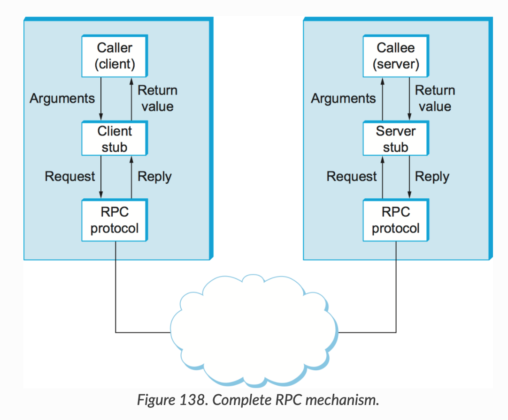

# gRPC

## RPC

- Remote Procedure Call
- 분산 네트워크 환경에서 조금 더 편하게 프로그래밍 하기 위해 등장
    - 클라이언트 - 서버 간의 커뮤니케이션에 필요한 상세한 정보는 최대한 감추고,
    - 개발자는 각 로직에만 집중할 수 있도록 클라이언트/서버는 일반 메소드를 호출하는 것처럼 개발 진행하면 됨



- caller/callee
    - 개발자가 필요한 비즈니스 로직을 생성하고 정의된 IDL (interface definition language)로 작성하여 stub을 호출
- stub
    - stub compiler가 IDL 파일을 읽어 원하는 language로 생성하고 파라미터를 마샬링/언마샬링 처리하여 RPC 프로토콜로 전달
        - 마샬링: 직렬화와 비슷한 개념
        - 직렬화는 byte stream으로 변환하는 것이지만 마샬링은 "변환하는 일련의 과정"을 뜻함
- RPC runtime
    - 통신하여 각 메시지 전달

## gRPC

### 장점

- 높은 생산성 & 효율적인 유지보수
    - 비즈니스 로직에 집중하여 빠른 서비스 개발이 가능
- 다양한 언어 및 플랫폼 지원
- 높은 메시지 압축률과 성능
    - HTTP/2 를 사용하여 헤더 압축률이 높음
    - 통신시점에는 바이너리 데이터로 통신하기 때문에 용량이 적음
    - HTTP/2 이기 때문에 양방향 스트림 통신이 가능
- gRPC는 네트워크 통신과 관련된 작업들을 대신 해줌
    - 소켓 프로그래밍을 통해서 네트워크 서비스 상에 존재하는 서비스를 실행하기 위해서는 네트워크에서 발생할 수 있는 다양한 예외상황들을 모두 핸들링 해주어야함

### 단점

- 간단한 RESTful API 제공 목적으로 부적합
- protobuf와 HTTP/2 에대한 러닝 커브
- 메시지가 바이너리로 전달되기 때문에 디버깅 어려움
    - bloomRPC 같은 것을 이용하면 ok

## Protocol Buffers

gRPC에서 IDL로 사용하고 있는 언어

.proto 파일을 protoc 컴파일러를 통해 각 언어로 소스 코드가 생성 됨

## 작업 하는 방법

### proto 생성

- enum, message 키워드를 이용하여 Object 정의
- service로 클래스 생성

```
// 자동 생성되는 클래스
service RegisterMember {
  // 클래스 메소드 생성

  //unary : 한 번 호출에 한 번 응답
  rpc Register(MemberRequest) returns (MemberResponse);
  //client stream : 클라이언트에서 스트림으로 전달, 서버에서는 한번 응답
  rpc RegisterClientStream(stream MemberRequest) returns (MemberResponse);
  //server stream : 클라이언트에서 한 번 전달, 서버에서 스트림으로 응답
  rpc RegisterServerStream(MemberRequest) returns (stream MemberResponse);
  //bi stream : 클라이언트/서버 모두 스트림으로 응답
  rpc RegisterBiStream(stream MemberRequest) returns (stream MemberResponse);
}
```

- `stream` 키워드를 이용하여 통신시 스트림으로 전달/응답할 것인지 명시할 수 있음

### generate source

- 각언어별로 proto 파일을 소스로 변경할 수 있는 컴파일러가 있음
- 여기서 만들어지는게 stub

### 비즈니스 로직 구현

- 클라이언트에서는 메소드를 호출하기만 해주면 됨
- 서버는 생성된 서비스를 상속받아 로직을 구현하면 됨


## Nirum RPC

- schema repository 가 따로 있고 고쳐서 배포하면 CI에서 python 코드로 만들고 pypi에 업로드
- 클라이언트와 서버에서는 원하는 버전으로 라이브러리 (stub)를 받아와서 코드 작성
    - 서버: target-service에서 TargetService를 상속받아서 서비스 로직을 구현함
    - 클라이언트: dodo-message-backend-manager에서 TargetService의 함수 호출


### Reference

[https://meetup.toast.com/posts/261](https://meetup.toast.com/posts/261)
[https://medium.com/@goinhacker/microservices-with-grpc-d504133d191d](https://medium.com/@goinhacker/microservices-with-grpc-d504133d191d)
